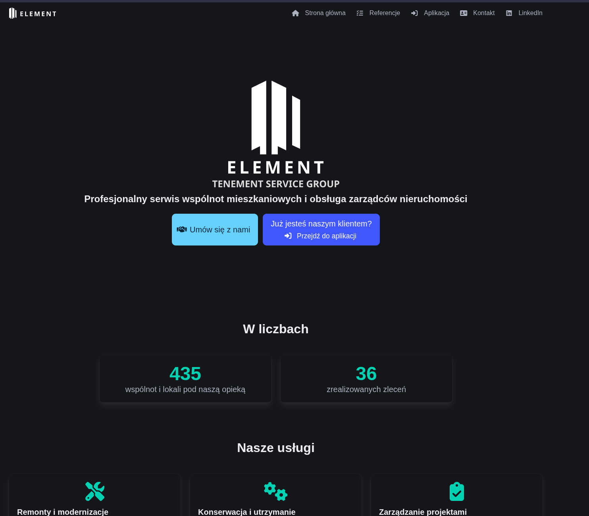

+++
authors = ["Jan Ligudziński"]
title = "In which I solo-unfuck a production system: #1 - Landing page"
description = "If only you knew how bad things really are."
date = 2025-10-09
[taxonomies]
tags = ["ETS Unfuck Series", "programming", "rust", "devops", "war story"]
+++

## Intro

I help a friend of mine run a small company that does work on tenements for property managers. You may ask yourself what such a company even needs a programmer for, and the answer is that we offer our clients a web app where they can keep track of all the requests for work and our updates on them, as well as an AI agent that takes calls from tenants and notes down any complaints or requests they may have. We in turn use it to talk to the clients in an organized way, keep tabs on our subcontractors, and generate some standard paper printouts for them to sign.
We also wanted to do some telemetry stuff with radio-enabled digital sensors - think water meters and such - at one point and may still do it in the future.
Anyway, this web app was developed in a very rushed way, with large sections recklessly vibe-coded, and while it's almost feature-complete for the foreseeable future, the time has come to take stock of all the tech debt and all the "I'll do it laters" that have accumulated over this year.

## Overview

Let's go over what we have in terms of resources and code.
The first thing we bought were our domains, one `.com.pl` and another simple `.pl` one, the latter of which we bought after my partner soberly noticed that it would be a pain to remember and type anything as long as the former when opening the web app. In retrospect, I regret buying the first one at all - the monopoly on `com.pl` domains is held by [domena.pl](https://domena.pl), and while they're cheap enough, their offering and UX is straight from the early 00s - there's no CLI, no API, just poorly-explained HTML forms to click through and several different admin panels for each feature. We ended up only using the  for our Google Workspace emails (maybe not the best choice either - their invoices are denominated in arms and legs).

Next was the hosting - we went with Hetzner, as we didn't need much and aren't likely to need much in the future either. We got a VPS with 4 VCPUs, 8 GB of RAM and 160GB storage, which at the time of writing isn't close to even one-quarter full, plus two S3-compatible object buckets (which reminds me: they charge a flat fee per bucket and eliminating one of them in production will be something we'll do later in this series).
The other things we pay for are a Twilio account with two phone numbers, an OpenAI one, and Postmark for transactional e-mails like forgot-password reset links.

As for what the software we've built and deployed looks like, it goes like this:

- Core app backend: Rust Axum, PostgreSQL over SeaORM, Redis (for sessions)
- Core app frontend: Angular with Bulma (Bootstrap is passé and I didn't want to come up with Tailwind styles for everything myself)
- AI app backend: Axum again (the quick and dirty prototype was in C#)
- All three of the above exist in two copies, one for the production environment and one for demos
- Mostly static landing page ("unfucking" which will be done in this post), done in Sveltekit.
- All of this is exposed to the outside world with different subdomains by an instance of Nginx with Certbot.


>*Why Rust for what seems to be just web-slop CRUD?*

Because I like the language and wanted to keep sharp in it. Also, if I had chosen to do the same thing at my side business as I had been doing at my day job at the time (C# and Blazor Server[^1]), I'd have wanted to blow my brains out.

## Why's it fucked?

Let me go over the things that are wrong with the current setup, in no particular order:

### No proper CI/CD, horrific manual deployment (I have complacently gotten used to the horror)

We don't really have automatic builds or deploys. The first time I deployed the app, I pushed its code and Docker-Compose template over SSH, ran `docker-compose build` then `docker-compose up -d` (struggling with typos and configs omitted). The update procedure is now much the same: `docker-compose build && docker-compose down && docker-compose up-d`, and we are lucky to only have users in one timezone that keep regular hours so we can afford the downtime.

>*Downtime?!*

It's only half a minute at worst, but it'd still be a bad look for me to do things this way during the working day so it happens at night.

We keep environment variables in `.env` files, which I think is fine, but we just have the one master `.env` that we share across all apps. How do we solve multiple environments then? Easy, we clone the same repo into other directories for the demo versions, change the relevant vars, knock out the shared parts like the database service, and run the same `docker-compose` commands in there.

How did I manage routing new domains through our Nginx reverse-proxy when I added each app and environment? I don't even know! I SSHed into the machine with Cursor and told it "refresh the damn certificates". *Not* maintainable or documentable.

>*💀💀💀*

If you are horrified, I am also; my intent and hope with these posts is that writing this out and pulling all this dirty laundry into the open sunlight will shame me into fixing these things and making my work look professional.

### No dedicated backups

We have whole-machine backups that come with Hetzner, and every so often I manually dump the database, but this seriously needs to change.

### Poor observability

We use the `log` crate in our backend apps, which is good (but not as good as `tracing` prescribed by Luca Palmieri's excellent [*Zero To Production*](https://www.zero2prod.com/index.html)). We log to stdout, which is bad, because then I need to actually log onto the server and do `docker-compose logs` to see them. You can easily see how this isn't really viable for problems that have occurred a while ago. Something on my to-do I-'ll-get-around-to-someday list is making these logs actually possible to browse and read. We also don't have an easy way to check the metrics of our machine without going into its Hetzner panel. If we had one, it would be great if we could correlate it to the logs too - see if CPU spikes when a particular endpoint runs, for example.

### Poor code

Many features were rushed, especially the earliest ones at the core of the app. The conversations that led to things happening in this way when we were new to the whole "running a business that has an app" thing and excited for it went mostly like this:

>Partner: "Hey, Janek, can we have that thing running by tomorrow? I told the client I'd show it tomorrow." (It is already evening)
>
>Me: "Sure."
>
>(Vibe-coding and manual testing ensues)
>
>(My partner proceeds to not show the feature off the next day because the client rescheduled)

This lack of time taken to slow down, rethink, refactor, has over time led to many code smells such as:
- Massive files that do too many things (especially Angular components)
- Dead code that doesn't actually run
- The same things repeated in multiple places
- Overgrown, cancerous patterns

For a concrete example of that last one, one low-hanging fruit is that as good little disciples of the Gang of Four, the School of Object-Oriented Programming, SOLID and everything else they always list as a requirement on junior job offers, we've been using a repository pattern to isolate the application layer from the actual guts of the system.
This way get the LI[^2] of SOLID. What's more, because we have the application-layer operations split into commands (which may change things) and queries (which may not) we also get to say the system has CQRS[^3] (and if pressed at an interview we can pontificate on how it's a natural extension of the Command pattern, which makes verbs into nouns that you can for example write down somewhere and make your source of truth, which you then get to call Event Sourcing - we don't do that, FYI).

Unfortunately, one brainless thing I've been doing is defining separate concrete implementations of these per-subdomain `UserRepository`, `WorkTicketRepository` traits when one concrete `DbContext` struct could have all of these capabilities - they're `Clone`ing and passing around the same damn SeaORM connection pool anyway and all they do is take up space in the `State` context of our Axum app.

>*Alright, I've heard enough. What are you going to do about it?*

Today we will be fixing the least-involved, least-broken part of the system: the landing page.

## The landing page



Pretty cool, huh? The numbers at the bottom are actually fetched through our API when you visit, so they're always up to date. This is done server-side, which is why we used SvelteKit here - the other reason was that we needed a minimal way to define some repeatable component templates. We've also got a contact form that sends us e-mails if you click the big cyan call-to-action button.

As I already said, we don't have CI/CD - this is what we'll be remedying here today. Fortunately for us, the app is very simple and consists of:

- one container:
  ```
  FROM node:current-alpine

  WORKDIR /app

  # Copy package files
  COPY package*.json ./

  # Install dependencies
  RUN npm ci

  # Copy source code
  COPY . .

  # Build the app
  RUN npm run build

  # Expose port
  EXPOSE 4000

  # Start the app
  CMD ["npm", "run", "preview", "--", "--host", "0.0.0.0", "--port", "4000"]
  ```
- one `docker-compose` template:
  ```yaml
  services:
    element-landing-page:
      build: .
      ports:
        - "4000:4000"
      environment:
        - NODE_TLS_REJECT_UNAUTHORIZED=0
        - NODE_ENV=production
        - PORT=4000
      restart: unless-stopped
      # Allow container to access host network for API calls
      extra_hosts:
        - "host.docker.internal:host-gateway"
  ```
- one Nginx `.conf` file:
  ```ngin
  server {
      listen 80;
      listen [::]:80;
      server_name ets-group.pl;

      location /.well-known/acme-challenge/ {
          root /var/www/certbot;
      }

      location / {
          return 301 https://$host$request_uri;
      }
  }

  server {
      listen 443 ssl;
      listen [::]:443 ssl;
      server_name ets-group.pl;

      ssl_certificate /etc/letsencrypt/live/ets-group.pl/fullchain.pem;
      ssl_certificate_key /etc/letsencrypt/live/ets-group.pl/privkey.pem;

      root /var/www/element-landing;
      index index.html;

      location / {
          proxy_pass http://host.docker.internal:4000;
          proxy_http_version 1.1;
          proxy_set_header Upgrade $http_upgrade;
          proxy_set_header Connection 'upgrade';
          proxy_set_header Host $host;
          proxy_cache_bypass $http_upgrade;
          proxy_set_header X-Real-IP $remote_addr;
          proxy_set_header X-Forwarded-For $proxy_add_x_forwarded_for;
          proxy_set_header X-Forwarded-Proto $scheme;
      }
  }
  ```
>*Nice. What now?*

## Our battle plan

What we want to do is:

- Make the container use an actual production-ready command rather than `preview`, which does what we need but isn't exactly best practice
- Set up CI/CD that will push it to a registry so we don't have to build it on the server
- Get rid of this particular docker-compose file completely
- Find some other way to serve the landing page than Nginx

### 1: general fixes

First things first, let's edit the Dockerfile to be in accordance with the state of the art and craft. As we have some SSR that requires Node, I'm told we need the Svelte adapter:

```bash
npm install --save-dev @sveltejs/adapter-node
```

Then use it instead of `adapter-auto` in `svelte.config.js`:

```javascript
import adapter from '@sveltejs/adapter-node';

export default {
  kit: {
    adapter: adapter({
      out: 'build'
    })
  }
};
```

Now `npm run build` will produce a `build` directory and `node build` will run the generated server. Let's change the `CMD` in the Dockerfile to reflect that:

```dockerfile
# ... all above as it was...
# 4000 was what preview listened to, let's keep it but the adapter's server by default listens on 3000
ENV PORT=4000
# Expose port
EXPOSE 4000


# Start the Node server generated by SvelteKit
CMD ["node", "build"]
```

And when we re-run the container and template, it still works:
```bash
[jan@srogi element-landing-page]$ http GET localhost:4000
HTTP/1.1 200 OK
(... actual HTML ...)
```

### 2: CI/CD

I was already working on this before I started writing the post, so I can just copy-paste the Github Actions YAML for the build and push job:

```yaml
name: ghcr-push

on:
  push:
    branches: ["main"]
  pull_request:
    branches: ["main"]

permissions:
  contents: read
  packages: write

env:
  REGISTRY: ghcr.io
  IMAGE_NAME: element-group-com-pl/element-landing-page

jobs:
  build:
    runs-on: ubuntu-latest
    steps:
      - uses: actions/checkout@v4
      - uses: docker/setup-buildx-action@v3
      - uses: docker/login-action@v3
        with:
          registry: ${{ env.REGISTRY }}
          username: ${{ github.actor }}
          password: ${{ secrets.GITHUB_TOKEN }}
      - uses: docker/build-push-action@v6
        with:
          context: .
          file: ./Dockerfile
          push: ${{ github.event_name == 'push' && github.ref == 'refs/heads/main' }}
          tags: |
            ${{ env.REGISTRY }}/${{ env.IMAGE_NAME }}:sha-${{ github.sha }}
            ${{ env.REGISTRY }}/${{ env.IMAGE_NAME }}:latest
          cache-from: type=gha
          cache-to: type=gha,mode=max
          provenance: false
```

What this does is react to pull requests and pushes to `main`, build the image, and in the case of a push upload it to a namespace in the registry named after our Github org. Not pictured: me naming the file with a comma instead of a period in its name and struggling for an embarrassingly long tiome.
Also not pictured: me not knowing that when you have a GitHub organization where you placed your repo, you first have to set an org-level flag that repository actions are allowed to modify things, *then* set the same one on the individual repo's level, *then* manually push the image from your own machine with a personal access token (the obsolete "classic" kind no less) so the package exists, because otherwise you can't whitelist the repo as allowed to modify that particular package. If you don't do this, you'll get a 403 error on push that will look like you just misconfigured something.

### 3: Removing the dedicated docker-compose

We don't really need a full docker-compose for one app. Ideally, the whole machine should have just one docker-compose file that defines literally everything running on it, but for today we'll be satisfied with reducing the count of compose templates from 6 (main app, main app demo, AI app, AI app demo, landing page, reverse proxy) to 5. We'll do something ugly and fold it into the Nginx one, which over time as we clean more things up and outsource them to the registry rather than building on the spot, will contain more and more of our system.

### 4: Let's yeet Nginx completely!

Let me remind you how our reverse-proxying works:


[^1]: I don't have the words to express how much I hate that particular framework. It might be bearable in WASM mode, but everything coming in a binary protocol over a single Websocket means you get absolutely zero useful information in your browser's devtools, so prepare to wait ages for the VS debugger to hit your breakpoint everytime an `HttpClient` hits your actual API. And then maybe another breakpoint in the VS window with the API. Also, if you need to ship a big non-static file to the browser for whatever reason, the real fun begins, because you are *not* going to fit it in one piece over that connection without crashing it.
[^2]: Liskov's Substitution Principle (you can expect any concrete implementation of a contract to be interchangeable with any others - not that I've ever seen anyone actually have two competing concrete implementations of a database layer in one end app) and the Interface Segregation Principle (abstract interfaces should only define operations they need to define, which kind of follows from the S - Single Responsibility Principle - but the I makes a neater mnemonic that people like the sound of)
[^3]: "Command/query responsibility segregation"
