+++
authors = ["Jan Ligudziński"]
title = "In which I fix a nasty production system: #2 - Actual complete CI/CD"
description = "Lots of me vs. GitHub combat."
date = 2025-10-13
[taxonomies]
tags = ["nasty system", "programming", "rust", "devops", "docker", "compose", "war story"]
+++

## Where we left off

In the [previous post in this series](../1-nasty-system-1), I introduced you to a nasty system I'd inherited from past me, and we managed to make it slightly less nasty by CI-ifying its simplest component - an almost-static landing page and overhauling the reverse proxy infrastructure routing different subdomains of our business' main domain to different components - we yote Nginx and replaced it with the much simpler Caddy[^1].
This leaves us with some more things to do before we can move on to proper CD:
- Push the main web app and its AI agent companion into our org's Docker registry on GitHub as we did the landing page
- Have our docker-compose refer to the images in the registry rather than locally building them from source and dockerfiles we push via SSH
- Move all the service definitions into the main `docker-compose.yml` we made the last time, and nuke the old source/dockerfile directories

## Agent app

### Dockerfile optimization

Let's start with the AI agent app. It doesn't directly depend on the database or the Redis cache[^2], so as long as it can access the API, we can extract into the main dockerfile as we please. Let's take a look at how it gets built:

```
FROM rust:1.89-slim-bookworm

RUN apt-get update && \
    apt-get install -y \
    pkg-config \
    libssl-dev \
    libssl3 \
    && rm -rf /var/lib/apt/lists/*

WORKDIR /usr/src/app
COPY Cargo.toml Cargo.lock ./
COPY api/Cargo.toml ./api/
COPY domain/Cargo.toml ./domain/

# Create dummy source files to build dependencies
RUN mkdir -p api/src domain/src
RUN echo "fn main() {}" > api/src/main.rs && \
    echo "pub const dummy: i32 = 0;" > domain/src/lib.rs

# Build dependencies (this layer will be cached unless Cargo files change)
RUN cargo build --release --bin api

RUN rm -rf api/src domain/src

# Copy actual source code
COPY . .

# Touch the files to bust cache

RUN touch api/src/main.rs domain/src/lib.rs

# Build the application with real source code
RUN cargo build --release --bin api

ENV RUST_LOG=info
EXPOSE ${PORT:-5099}

CMD ["/usr/src/app/target/release/api"]
```

This is honestly kind of suboptimal - some low-hanging fruit here would be separating the build stage and the runtime stage to minimize the size.

>*What's with the `touch` command and the manual deletion and creation of the dummy files?*

There's a little war story behind that. As I hinted at in the first post, I try to keep my backend apps segregated into clean-architecture-ish layers: a `domain` that defines the basic entities and rules in play, an `application` that actually does stuff with them, an `infrastructure` that contains all the ugly external-world-touching stuff like database drivers or HTTP clients, and an `api` that exposes the application to actual users. I could do that all as modules of one big Rust crate, but having multiple crates that share a *workspace* to cache common dependencies is much better for compile times.
The problem is that Cargo doesn't really have a dedicated command for "just download and build the dependencies our actual app will use, which rarely change" and if my Dockerfile just said "copy all the source code before building", changing just our own code would trigger a redownload and rebuild of absolutely everything involved.

This we would not want. So, after we pull in all the `Cargo.toml` manifests that specify our deps, we create dummy `lib.rs` and `main.rs` files so Cargo can say "this is a valid Rust project that will compile to actual libraries and executables, we can go ahead with `build`", then after the dependency fetching and building we swap in the real source code. Why the `touch`? Docker checks if a file has changed by looking at its modification time, not its size or actual contents, so if we don't manually update that, Docker will just keep the dummy files in its cache and build useless binaries again.

>*That sounds a lot more complicated than it should be. Haven't they fixed this in Cargo by now?*

As far as I know, no. But now that you point it out, there *is* a more efficient way to do this thing, and it's called [Chef](https://github.com/LukeMathWalker/cargo-chef).
Why wasn't I using it already? Your guess is as good as mine, I think I was just too fatigued after finally figuring out a flow that worked to do things all over again. Another thing you might notice is that we don't do a multi-stage build where the final container is just the executable and whatever it needs at runtime. Let's maybe remedy both of these problems at once:

```
# ---------- Build stage ----------
FROM rust:1-slim-bookworm AS chef

# Get cargo-chef
RUN cargo install cargo-chef

WORKDIR /app

FROM chef AS planner
COPY . .
RUN cargo chef prepare --recipe-path recipe.json

FROM chef AS builder
# Build deps
RUN apt-get update && \
  apt-get install -y --no-install-recommends \
  pkg-config \
  libssl-dev \
  ca-certificates \
  binutils \
  && rm -rf /var/lib/apt/lists/*

COPY --from=planner /app/recipe.json recipe.json
# Build dependencies
RUN cargo chef cook --release --recipe-path recipe.json

# Build actual app
COPY . .
RUN cargo build --release --bin api

# ---------- Runtime stage ----------
FROM debian:bookworm-slim AS runtime

# Only the runtime bits you need for an OpenSSL-linked binary
RUN apt-get update && \
  apt-get install -y --no-install-recommends \
  libssl3 \
  ca-certificates \
  && rm -rf /var/lib/apt/lists/*

# Run as non-root
RUN useradd -u 10001 -r -g nogroup -s /usr/sbin/nologin -d / nonroot

WORKDIR /app
COPY --from=builder /app/target/release/api /app/api

ENV RUST_LOG=info

# EXPOSE doesn't support default values directly; use ARG + ENV for flexibility
ARG PORT=5099
ENV PORT=${PORT}
EXPOSE ${PORT}

USER 10001
ENTRYPOINT ["/app/api"]

```

### CI

Then we get to copy-paste the build and push job we used in the landing page repo:

```yaml
name: build and push

on:
  push:
    branches: ["master"]
  pull_request:
    branches: ["master"]

permissions:
  contents: read
  packages: write

env:
  REGISTRY: ghcr.io
  IMAGE_NAME: element-group-com-pl/goldenhand-golem

jobs:
  build:
    runs-on: ubuntu-latest
    steps:
      - uses: actions/checkout@v4
      - uses: docker/setup-buildx-action@v3
      - uses: docker/login-action@v3
        with:
          registry: ${{ env.REGISTRY }}
          username: ${{ github.actor }}
          password: ${{ secrets.GITHUB_TOKEN }}
      - uses: docker/build-push-action@v6
        with:
          context: .
          file: ./Dockerfile
          push: ${{ github.event_name == 'push' && github.ref == 'refs/heads/master' }}
          tags: |
            ${{ env.REGISTRY }}/${{ env.IMAGE_NAME }}:sha-${{ github.sha }}
            ${{ env.REGISTRY }}/${{ env.IMAGE_NAME }}:latest
          cache-from: type=gha
          cache-to: type=gha,mode=max
          provenance: false
```

We push this to origin and, because this time we didn't pre-create the `goldenhand-golem` package in GHCR by manually pushing, it gets automatically created with the repo's action already allowed to push to it.
Unfortunately, one advantage of our (horrible, very bad, no good) deployment flow with the images getting built locally was that we wouldn't have to re-pull the Rust images and dependencies on every build thanks to the caching layer tricks we'd used and now Cargo Chef, and this advantage is now lost to us, but that's not a bad price to pay for having actual CI. *Maybe* in the future we'll reimplement that in some more civilized way if we care enough.

### Integration into central compose file

Now, we can add compose entries for the two instances of `golem` we want to run:

```yaml
golem-prod:
  image: ghcr.io/element-group-com-pl/goldenhand-golem:latest
  pull_policy: always
  env_file:
    - ./golem/.env.prod
  ports:
    - "5100:5100"
  restart: unless-stopped
  healthcheck:
    test: ["CMD", "curl", "-f", "http://localhost:5100/health"]
    interval: 30s
    timeout: 10s
    retries: 3
    start_period: 40s
  networks:
    - webnet
# ... same for golem-demo, but with another port and env file
```


And after pushing the new `main-machine` compose file and the requisite .envs to said machine we can scrap the old source directory and its compose:

```
root@ubuntu-8gb-fsn1-1:~# cd goldenhand-golem
root@ubuntu-8gb-fsn1-1:~/goldenhand-golem# docker-compose down
Stopping goldenhand-golem_agent-demo_1 ... done
Stopping goldenhand-golem_agent-prod_1 ... done
Removing goldenhand-golem_agent-demo_1 ... done
Removing goldenhand-golem_agent-prod_1 ... done
Removing network goldenhand-golem_default
root@ubuntu-8gb-fsn1-1:~/goldenhand-golem# cd ../main-machine
root@ubuntu-8gb-fsn1-1:~/main-machine# docker-compose up -d
Creating network "main-machine_default" with the default driver
Pulling golem-prod (ghcr.io/element-group-com-pl/goldenhand-golem:latest)...
latest: Pulling from element-group-com-pl/goldenhand-golem
5c32499ab806: Pull complete
f7dca50eac3a: Pull complete
2a2d4acc790a: Pull complete
8d9507874b7c: Pull complete
8aefda335d2e: Pull complete
Digest: sha256:7dd9ae7be4ea7690ef4deeca27cd069571bb3153045a25ec27fe7cef686847dd
Status: Downloaded newer image for ghcr.io/element-group-com-pl/goldenhand-golem:latest
main-machine_caddy_1 is up-to-date
main-machine_landing-page_1 is up-to-date
Creating main-machine_golem-prod_1 ... done
Creating main-machine_golem-demo_1 ... done
root@ubuntu-8gb-fsn1-1:~/main-machine# http GET https://call.ets-group.pl/health
HTTP/1.1 200 OK
Alt-Svc: h3=":443"; ma=2592000
Content-Length: 33
Content-Type: application/json
Date: Fri, 10 Oct 2025 18:53:22 GMT
Via: 1.1 Caddy

{
    "status": "ok",
    "version": "0.1.0"
}


root@ubuntu-8gb-fsn1-1:~/main-machine# http GET https://call-demo.ets-group.pl/health
HTTP/1.1 200 OK
Alt-Svc: h3=":443"; ma=2592000
Content-Length: 33
Content-Type: application/json
Date: Fri, 10 Oct 2025 18:53:26 GMT
Via: 1.1 Caddy

{
    "status": "ok",
    "version": "0.1.0"
}


root@ubuntu-8gb-fsn1-1:~/main-machine# cd ..
root@ubuntu-8gb-fsn1-1:~# rm -r goldenhand-golem
root@ubuntu-8gb-fsn1-1:~# ls
goldenhand-rs  goldenhand-rs-demo  main-machine
```

One down, two to go. Next up: the main web app.

## GoldenHand

I named our main web app that after the Polish idiom "złota rączka", "golden \[little\] hand" for a handyman or any dude who can fix things, when in the early design stages I was under the impression our app was going to be something like Uber for small repairs with the end user being individual tenants. It's stuck around and no one has raised any objections to it. Anyway, our job with overhauling this repo will be slightly more complicated. As I've already said, it's a monorepo of two projects that compile down to two Docker containers - a separate backend API and a frontend SPA. What's more, the original docker-compose everything started from also originated in this repo, and it's what defines the database and Redis cache containers, so after we figure out how to do proper CI and image pushing for the apps themselves, we'll have to figure out some way to safely exfiltrate the database so it's not gone when we nuke the old compose and source directories.

### Planning

Before we do anything else, we need to find a way to automatically deploy both the backend and the frontend. Considering the differences in build times and the fact that they're different containers in the compose, the sane approach would be to build and push them separately.

>*Considering that this is a monorepo and the backend and frontend seem pretty tightly coupled, why not just build and push both in one CI step? Or even build and have one container that serves both the API and the GUI?*

Good question. From where we're standing right now, I can see a bad scenario where compiling and deploying the backend takes much longer than the frontend, so we might end up with a several-minute period of what I could call "hidden downtime" where the two are out of sync and the frontend is trying to call API endpoints that don't exist yet or have changed in incompatible ways. (And this is still assuming we're responsible people who won't push the app to `master` in a state where the two are incompatible in the first place, of course.)

However, it's also exactly because of that difference in build times that I'd like to have a fast loop for the frontend, where there's a bigger chance of me slipping up with a typo or something and leaving the app in a state that needs a quick hotfix. Let me outsource my brain real quick:

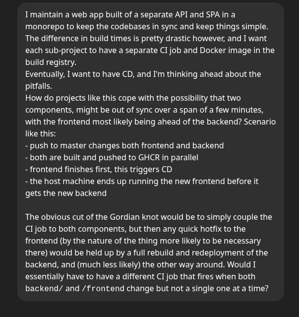

>*Typical.*

Bite me. Anyway, what the oracle told me is that I've been doing everything wrong, starting with the fact I use "latest" as the tag for my images in the compose file. Considering that our ideal flow is like this:

- push to master and release a new version into the registry on any of the app repos
- OR change the compose template in its own repo when we add or remove something
- the host machine gets the newest compose template (if applicable) and pulls the latest images it needs, then runs them

What we should be doing is:
- we tag the images with their unique commit digests as we build/push them
- we have the IaC repo store a committed .env file with the tags of the images currently in use
- when CI is done on one of the app repos, it automatically commits a new version of the .env file where the hash has changed; depending on whether we've changed both backend and frontend or just one of them, only one or both of them will change, but only when both are actually built and in the registry in the latter case
- this triggers CD in the IaC repo, we push the new state to the machine and deploy it

What's more, I thought ahead and asked GPT about how we could do blue-green deployments with our general setup.

>*Please explain for the interns, juniors and students in the audience.*

Basically, as I've noted in the gallery of horrors in the first post, the way we currently do updates - taking containers down before putting them back up with a new version of their image - necessarily involves some downtime. A strategy that Enterprise-Quality Programmers employ to avoid this is to have two instances of the same service running behind a reverse proxy or load balancer, basically a micro scale of "horizontal scaling" where you add more machines and instances:

- An update is pushed, the currently running instance is "blue"
- We pull the new image and run it as "green"
- When "green" is done starting up and can answer health checks, we make the proxy route incoming requests to "green"
- We kill "blue" off and "green" takes its place, the users don't notice anything happened (if the service is stateless, anyway; this could get hairy if we have persistent websocket connections or anything of the sort, luckily we don't - I've researched ahead and noted getting around to that in my TODOs just for improvement's sake, though; maybe I'll cover this in post 3)
- The bloody cycle of reincarnation continues on the next update, with green getting killed to make way for blue.

We'll actually split the One True Compose into two down the line - there'll be a `main-machine` template with our actual apps, parameterized over blue and green, the Caddy in front of both, both will share a global/external Docker network, and there'll be a script to switch on deployment - but that's for later. We might also do splitting per environment and not repeat ourselves with services like `api-prod` and `api-demo`: both could be just `api` running in different Compose projects with an `ENV_NAME` parameter.

### CI pipelines

Let's begin by rebuilding the One True Compose to use environment variables for the image tags, for example:

```
services:
  golem-prod:
    image: ${GOLEM_IMAGE}
```

And commit a `versions.env` file that we will pass as an argument to docker-compose when we deploy:

```
GOLEM_IMAGE=ghcr.io/element-group-com-pl/goldenhand-golem:latest
LANDING_PAGE_IMAGE=ghcr.io/element-group-com-pl/element-landing-page:latest
```

Now let's go to the landing page repo and implement the update logic in its CI, just adding this under the build and push steps we have so far:

>*\[Record scratch\]*
>*Wouldn't that be a little too much in one file? If I remember right, you already do builds, then you conditionally push, then you want to add the version-setting flow?*

Actually, yeah, that's too much. Let's split into:

- `build.yml` - this runs on PRs to master and just builds to see if the PR compiles
- `publish.yml` - this runs on actual pushes, pushes to the container registry, and triggers:
- `update.yml` - this will bump the version downstream

`build.yml` will be mostly unchanged, we'll just delete the `push` trigger, the docker login action and disable the push flag in "build and push".

`publish.yml` will get some additional steps that will create an artifact for the build, telling us what the new digest is:

```yaml
- name: Write digest artifact
  if: steps.build.outputs.digest != ''
  run: |
    echo "ghcr.io/element-group-com-pl/element-landing-page@${{ steps.build.outputs.digest }}" > digest.txt
- uses: actions/upload-artifact@v4
  if: steps.build.outputs.digest != ''
  with:
    name: landing-digest-${{ github.sha }}
    path: digest.txt
```

Then update.yml will look like this:

```yaml
name: update

on:
  workflow_run:
    workflows: [publish]
    types: [completed]

permissions:
  contents: write
  pull-requests: write
  actions: read

env:
  TARGET_REPO: element-group-com-pl/element-iac
  TARGET_BRANCH: main
  LOCKFILE_PATH: main-machine/versions.env
  KEY: LANDING_PAGE_VERSION

jobs:
  bump:
    if: ${{ github.event.workflow_run.conclusion == 'success' }}
    runs-on: ubuntu-latest
    steps:
      - name: Download digest artifact from publish run
        id: dl
        uses: actions/github-script@v7
        with:
          script: |
            const run_id = context.payload.workflow_run.id
            const { data: arts } = await github.rest.actions.listWorkflowRunArtifacts({
              owner: context.repo.owner, repo: context.repo.repo, run_id
            })
            const art = arts.artifacts.find(a => a.name.startsWith('landing-digest-'))
            if (!art) core.setFailed('No digest artifact found')
            const { data: zip } = await github.rest.actions.downloadArtifact({
              owner: context.repo.owner, repo: context.repo.repo,
              artifact_id: art.id, archive_format: 'zip'
            })
            require('fs').writeFileSync('artifact.zip', Buffer.from(zip))
      - run: unzip -o artifact.zip
      - name: Checkout target (lockfile) repo
        uses: actions/checkout@v4
        with:
          repository: ${{ env.TARGET_REPO }}
          ref: ${{ env.TARGET_BRANCH }}
          token: ${{ secrets.GH_BOT_TOKEN }} # PAT with repo write on TARGET_REPO
          path: lockrepo

      - name: Update lockfile with digest
        working-directory: lockrepo
        run: |
          set -euo pipefail
          REF="$(cat digest.txt)"
          sed -i -E "s|^(${KEY}=).*|\1${REF}|" "${LOCKFILE_PATH}"
          git config user.name  "ci-bot"
          git config user.email "ci-bot@users.noreply.github.com"
          git checkout -B chore/landing-digest-${{ github.sha }}
          git commit -am "chore(lock): ${KEY} -> ${REF}"
          git push -u origin chore/landing-digest-${{ github.sha }}

      - name: Open PR in target repo and enable auto-merge
        uses: peter-evans/create-pull-request@v6
        with:
          token: ${{ secrets.GH_BOT_TOKEN }}
          path: lockrepo
          base: ${{ env.TARGET_BRANCH }}
          branch: chore/landing-digest-${{ github.sha }}
          title: "chore(lock): ${KEY} -> $(cat digest.txt)"
          add-paths: ${{ env.LOCKFILE_PATH }}
      - uses: peter-evans/enable-pull-request-automerge@v3
        with:
          token: ${{ secrets.GH_BOT_TOKEN }}
          pull-request-number: ${{ steps.create_pull_request.outputs.pull-request-number }}
          merge-method: squash

```

Sike! That stuff didn't run and I spent way too much time trying to unfuck this chain of artifact-uploading and downloading and all that before we even got to the part where we push to the IaC repo. So let's move the update.yml to the IaC repo as its own custom action and callable workflow that will accept a list of versions as an argument:

```yaml
name: Update lockfile
description: Replace or append KEY=VALUE pairs in a .env-style lockfile
inputs:
  lockfile_path:
    description: Path to the .env lockfile to update
    required: true
  versions_lines:
    description: Newline-separated KEY=VALUE pairs
    required: true
runs:
  using: "composite"
  steps:
    - shell: bash
      env:
        LOCKFILE: ${{ inputs.lockfile_path }}
        LINES: ${{ inputs.versions_lines }}
      run: |
        set -euo pipefail
        python3 .github/actions/update-lockfile/update_lockfile.py

```

GPT initially wanted to crap out a whole Python script as a YAML multiline string (ew) but I moved it out to its own `update_lockfile.py`:

```python
#!/usr/bin/env python3
import os
import sys

lockfile = os.environ.get("LOCKFILE", "versions.env")
lines_in = os.environ.get("LINES", "")

if not lines_in:
    print("No versions provided (LINES env is empty).", file=sys.stderr)
    sys.exit(1)

# Parse incoming KEY=VALUE pairs
updates = {}
for raw in lines_in.splitlines():
    s = raw.strip()
    if not s or s.startswith("#"):
        continue
    if "=" not in s:
        print(f"Invalid line (no '='): {raw!r}", file=sys.stderr)
        sys.exit(1)
    k, v = s.split("=", 1)
    k = k.strip()
    v = v.strip()
    if not k:
        print(f"Invalid key in line: {raw!r}", file=sys.stderr)
        sys.exit(1)
    updates[k] = v

# Read existing file (treat missing as empty)
try:
    with open(lockfile, "r", encoding="utf-8") as f:
        cur = f.read().splitlines()
except FileNotFoundError:
    cur = []

# Build index of existing keys (ignore commented lines)
index = {}
for i, ln in enumerate(cur):
    ls = ln.lstrip()
    if not ls or ls.startswith("#") or "=" not in ln:
        continue
    k = ln.split("=", 1)[0].strip()
    if k and k not in index:
        index[k] = i  # first occurrence wins

# Replace existing keys or append new ones
for k, v in updates.items():
    line = f"{k}={v}"
    if k in index:
        cur[index[k]] = line
    else:
        cur.append(line)

# Write back (ensure trailing newline)
with open(lockfile, "w", encoding="utf-8") as f:
    f.write("\n".join(cur) + "\n")

```
Then an `update.yml` workflow in IaC that refers to the action:

```yaml
name: update
on:
  workflow_call:
    inputs:
      lockfile_path:
        type: string
        required: true
      versions_lines:
        type: string
        required: true
permissions:
  contents: write
  pull-requests: write

jobs:
  bump:
    runs-on: ubuntu-latest
    steps:
      - uses: actions/checkout@v4
      - uses: ./.github/actions/update-lockfile
        with:
          lockfile_path: versions.env
          versions_lines: |
            LANDING_PAGE_VERSION=ghcr.io/your-org/landing@sha256:abc...
            GOLEM_IMAGE=ghcr.io/your-org/golem@sha256:def...
      - name: Create PR
        id: cpr
        uses: peter-evans/create-pull-request@v6
        with:
          branch: chore/lock-${{ github.run_id }}
          base: main
          commit-message: "chore(lock): bump ${{ github.event.client_payload.lockfile_path }}"
          title: "chore(lock): bump ${{ github.event.client_payload.lockfile_path }}"
          add-paths: ${{ github.event.client_payload.lockfile_path }}
        # (Optional) Auto-approve if your branch protection requires 1 approval
        # Grant "pull-requests: write" permission for this job (already set above).
      # - name: Auto-approve PR
      #   if: steps.cpr.outputs.pull-request-number != ''
      #   uses: hmarr/auto-approve-action@v4
      #   with:
      #     pull-request-number: ${{ steps.cpr.outputs.pull-request-number }}
      - name: Enable auto-merge
        if: steps.cpr.outputs.pull-request-number != ''
        uses: peter-evans/enable-pull-request-automerge@v3
        with:
          pull-request-number: ${{ steps.cpr.outputs.pull-request-number }}
          merge-method: squash
```

What this will do is let other repositories tell our IaC repo to update its `versions.env` file with new image refs passed as a newline-separated string of `KEY=VALUE` pairs. Now, we can go back to the landing page's `publish.yml` and add a second job that will call this workflow in the IaC repo:

```yaml
  build:
  # ...push to docker
      - name: Compute immutable ref
        id: imm
        run: echo "ref=${{ env.REGISTRY }}/${{ env.IMAGE_NAME }}@${{ steps.build.outputs.digest }}" >> "$GITHUB_OUTPUT"
  bump-lockfile:
    needs: build
    uses: element-group-com-pl/element-iac/.github/workflows/update.yml@main
    with:
      lockfile_path: main-machine/versions.env
      versions_lines: |
        LANDING_PAGE_VERSION=${{ needs.build.outputs.ref }}
```

Some other snags we hit ~~before we got `element-landing-page` bumping its own version in the IaC repo automatically~~:

- The org must have a setting that lets actions make pull requests at all:
  
- And this global policy:
  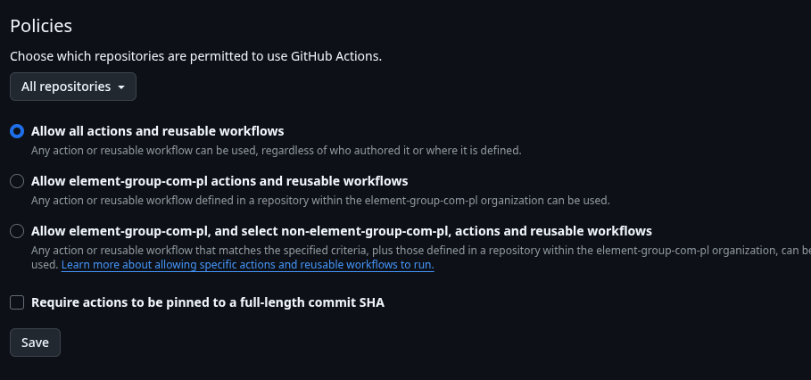
- The target repo must have a flag that lets other repos' actions see it:
  
- The calling workflow must have the same or higher permissions as the callee requires:
  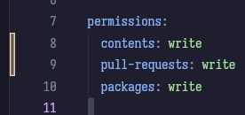

>*Wait, why was that crossed out?*

### So that was a fucking lie

I lied, I couldn't get this working without constantly running into an error or some suggested workaround that required a PAT anyway and just gave up on this Frankenstein approach with juggling digest SHAs around, writing them to files or variables and then using them as inputs again. I'm taking a break for food and aspirin (for the headache) as I finish writing this sentence.

### New plan

What we *can* do is have our IaC repo just have a `deploy` workflow we can trigger through inter-repo events (`repository_dispatch`), which will unfortunately require a PAT, and have a self-hosted GitHub runner run on our machine and do the actual deployment. Instead of exact digests, we'll refer to our images with a tag like "release" or "prod", which we'll move to the newest version on every publication, and thus avoid the unstable and discouraged "latest". How will the "actual deployment" part work?
Github recommends that we use a "self-hosted runner" and configure the job to "runs-on" it, let's install it:

```
root@ubuntu-8gb-fsn1-1:~# mkdir actions-runner && cd actions-runner
root@ubuntu-8gb-fsn1-1:~/actions-runner# curl -o actions-runner-linux-x64-2.328.0.tar.gz -L https://github.com/actions/runner/releases/download/v2.328.0/actions-runner-linux-x64-2.328.0.tar.gz
  % Total    % Received % Xferd  Average Speed   Time    Time     Time  Current
                                 Dload  Upload   Total   Spent    Left  Speed
  0     0    0     0    0     0      0      0 --:--:-- --:--:-- --:--:--     0
100  216M  100  216M    0     0   195M      0  0:00:01  0:00:01 --:--:--  273M
root@ubuntu-8gb-fsn1-1:~/actions-runner# echo "01066fad3a2893e63e6ca880ae3a1fad5bf9329d60e77ee15f2b97c148c3cd4e  actions-runner-linux-x64-2.328.0.tar.gz" | shasum -a 256 -c
actions-runner-linux-x64-2.328.0.tar.gz: OK
root@ubuntu-8gb-fsn1-1:~/actions-runner# tar xzf ./actions-runner-linux-x64-2.328.0.tar.gz
root@ubuntu-8gb-fsn1-1:~/actions-runner# ls
actions-runner-linux-x64-2.328.0.tar.gz  bin  config.sh  env.sh  externals  run-helper.cmd.template  run-helper.sh.template  run.sh  safe_sleep.sh
root@ubuntu-8gb-fsn1-1:~/actions-runner# rm actions*
root@ubuntu-8gb-fsn1-1:~/actions-runner# ls
bin  config.sh  env.sh  externals  run-helper.cmd.template  run-helper.sh.template  run.sh  safe_sleep.sh
root@ubuntu-8gb-fsn1-1:~/actions-runner# ./config.sh --url https://github.com/element-group-com-pl --token (REDACTED)
Must not run with sudo
# we create a special user just for the runner
adduser --system --group --home /home/github-runner github-runner
usermod -aG docker github-runner
cd ..
mv ./actions-runner /home/github-runner/actions-runner
su github-runner
This account is currently unavailable
# we can't actually do that but we can do `sudo -u github-runner whatever command`
# (we redownload everything as we can't be arsed to muck with the file ownerships and permissions)
cd /home/github-runner/actions-runner
root@ubuntu-8gb-fsn1-1:/home/github-runner# sudo -u github-runner ./config.sh --url https://github.com/element-group-com-pl --token (REDACTED)

--------------------------------------------------------------------------------
|        ____ _ _   _   _       _          _        _   _                      |
|       / ___(_) |_| | | |_   _| |__      / \   ___| |_(_) ___  _ __  ___      |
|      | |  _| | __| |_| | | | | '_ \    / _ \ / __| __| |/ _ \| '_ \/ __|     |
|      | |_| | | |_|  _  | |_| | |_) |  / ___ \ (__| |_| | (_) | | | \__ \     |
|       \____|_|\__|_| |_|\__,_|_.__/  /_/   \_\___|\__|_|\___/|_| |_|___/     |
|                                                                              |
|                       Self-hosted runner registration                        |
|                                                                              |
--------------------------------------------------------------------------------

# Authentication


√ Connected to GitHub

# Runner Registration

Enter the name of the runner group to add this runner to: [press Enter for Default]

Enter the name of runner: [press Enter for ubuntu-8gb-fsn1-1]

This runner will have the following labels: 'self-hosted', 'Linux', 'X64'
Enter any additional labels (ex. label-1,label-2): [press Enter to skip]

√ Runner successfully added
√ Runner connection is good

# Runner settings

Enter name of work folder: [press Enter for _work]

√ Settings Saved.

root@ubuntu-8gb-fsn1-1:/home/github-runner# sudo -u github-runner ./run.sh

√ Connected to GitHub

Current runner version: '2.328.0'
2025-10-11 18:19:05Z: Listening for Jobs
^CExiting...
Runner listener exit with 0 return code, stop the service, no retry needed.
Exiting runner...
root@ubuntu-8gb-fsn1-1:/home/github-runner# sudo -u github-runner ./run.sh &
[1] 1165533
root@ubuntu-8gb-fsn1-1:/home/github-runner#
√ Connected to GitHub

Current runner version: '2.328.0'
2025-10-11 18:19:14Z: Listening for Jobs
```

Tada:

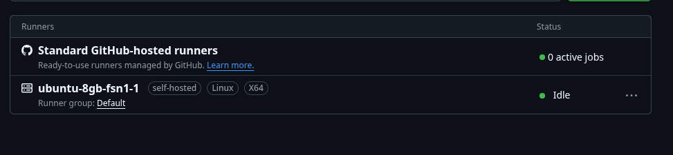

Now, we can create a new, really minimal `deploy.yml` workflow in the IaC repo that will run on `repository_dispatch`, `push` and `workflow_dispatch` (so we can manually test it) events:

```yaml
name: deploy
on:
  push:
    branches: ["main"]
  repository_dispatch:
    types: [update-main-machine]
  workflow_dispatch:

jobs:
  deploy:
    concurrency: "main-machine"
    runs-on: [self-hosted, linux]
    steps:
      - uses: actions/checkout@v4
      - name: Login to GHCR (read-only PAT)
        run: echo "${{ secrets.GHCR_PAT }}" | docker login ghcr.io -u ${{ github.actor }} --password-stdin
      - name: Pull & apply
        working-directory: main-machine
        run: |
          docker compose pull
          docker compose up -d --remove-orphans
```

(We'll have to manually pull down the other compose btw)

I also set the PAT to the one we used earlier:

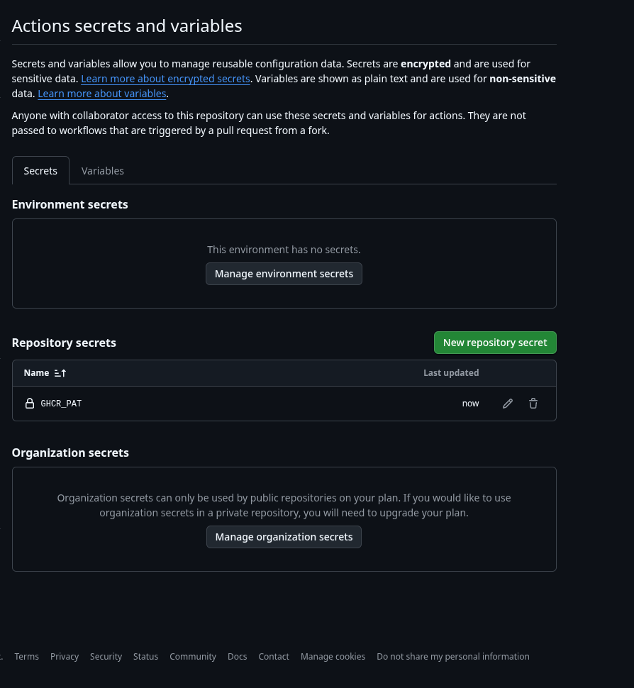

One last thing to hold up at before we pull the trigger: the `.env` files our compose refers to won't actually be there when the machine pulls the repo from Github, because we wisely .gitignored them. Up until now, our deployments consisted of us pushing the whole `main-machine` directory over SSH, us `cd`ing into it with the .envs safely transferred from our local dev box as well, and manually chanting the usual spells.

There are at this point three sane options:

- Use a fancy third-party secret manager, like they do at Big Enterprise (TM). This is yet another additional resource for us to create and keep track of, and the path of most resistance.
- Commit the .envs in some asymmetrically encrypted form (we still have to do decryption on the host) - likely the best overall, but still more work when I just want to get this over with
- Create a global directory for them on the machine and point the IaC files at it with an absolute path - lazy, but this will actually work, and I can do a very quick and dirty Bash script to update them every time they change on my dev box:

```bash
#!/bin/bash
ssh root@machine 'mkdir -p /opt/element/env'
rsync -av ./env/ root@machine:/opt/element/env
ssh root@machine 'chown -R github-runner /opt/element/env' # so our runner can access them
```

And change the compose entries accordingly:

```yaml
services:
  golem-prod:
    image: ghcr.io/element-group-com-pl/goldenhand-golem:latest # <-- we'll eventually change this to an actual tag like "current release"
    pull_policy: always
    env_file:
      - /opt/element/env/golem/.env.prod # <- where we put the envs now
    ports:
      - "5100:5100"
    restart: unless-stopped
    healthcheck:
      test: ["CMD", "curl", "-f", "http://localhost:5100/health"]
      interval: 30s
      timeout: 10s
      retries: 3
      start_period: 40s
    networks:
      - webnet
# ...
```

Let's quickly take down the old compose, push and what do we see in our SSH?

```
root@ubuntu-8gb-fsn1-1:~# 2025-10-11 19:56:41Z: Running job: deploy
2025-10-11 19:56:51Z: Job deploy completed with result: Succeeded
```

Check the services? They all run. Wonderful. We can decommission the old `main-machine` repository's clone on said machine now.


Docker-compose names its groupings of containers after the directory the .yml template is in. Because we recreated the manually pulled `main-machine` directory exactly in our CI pull, the new one and the old one were named the same and so `down`ing the old one before deleting it took down the containers the new one had spawned (so I manually started the deploy job again and fixed it). Don't be like me, just do things right from the start.


### New technical debt incurred so far:

Down the line it might be a good idea to switch to the SOPS[^3]/`age` stack suggested by GPT, where we'll generate a key pair on the server, take the public half out and encrypt our .envs with it before committing them, rather than having to "manually remember" to update the untracked .envs and push them by SSH. However, we are trying to achieve our operational objective for this post here: get *everything* into a mostly sane CI/CD flow sooner than later.

### Bringing the rest of the project in line

We now need to change the workflows for `golem` and `landing-page` to tag the pushed image with a stable "release" tag (where "latest" is considered harmful), use a PAT (unfortunately necessary with the `repository_dispatch` approach we've taken), and trigger the IaC repo's deploy workflow when all is said and done.
In `landing-page`'s `publish.yml`:

```yaml
- name: Promote to :release
  run: |
    docker buildx imagetools create \
      -t ghcr.io/element-group-com-pl/element-landing-page:release \
      ghcr.io/element-group-com-pl/element-landing-page@${{ steps.build.outputs.digest }}
- name: Trigger deploy
  uses: peter-evans/repository-dispatch@v3
  with:
    token: ${{ secrets.IAC_REPO_TOKEN }} # PAT with repo+workflow on element-iac
    repository: element-group-com-pl/element-iac
    event-type: deploy-main-machine
    client-payload: '{"service":"landing"}'
```
Then the same thing in `golem`, just adding `id: build` to the build step so the promote step can refer to the digest. Then we change the `:latest` to `:release` in the IaC repo, push and everything goes fine.

### The moment of truth

Let's make a very small change to the landing page:

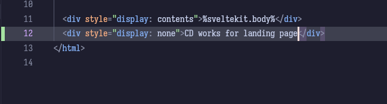

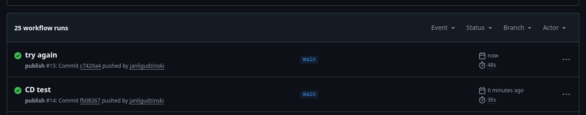

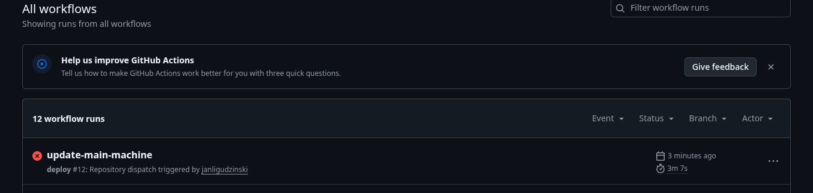

Oops, we got Compose errors because we weren't `down`ing the old containers in the deploy script. Also, I had to manually restart the Github runner because when I'd started it as a daemon of my previous SSH session, it died when the session closed. Let's make it a system service so it auto-runs:

```
root@ubuntu-8gb-fsn1-1:/home/github-runner# ./svc.sh install github-runner
Creating launch runner in /etc/systemd/system/actions.runner.element-group-com-pl.ubuntu-8gb-fsn1-1.service
Run as user: github-runner
Run as uid: 108
gid: 111
Created symlink /etc/systemd/system/multi-user.target.wants/actions.runner.element-group-com-pl.ubuntu-8gb-fsn1-1.service → /etc/systemd/system/actions.runner.element-group-com-pl.ubuntu-8gb-fsn1-1.service.
root@ubuntu-8gb-fsn1-1:/home/github-runner# ./svc.sh start

/etc/systemd/system/actions.runner.element-group-com-pl.ubuntu-8gb-fsn1-1.service
● actions.runner.element-group-com-pl.ubuntu-8gb-fsn1-1.service - GitHub Actions Runner (element-group-com-pl.ubuntu-8gb-fsn1-1)
     Loaded: loaded (/etc/systemd/system/actions.runner.element-group-com-pl.ubuntu-8gb-fsn1-1.service; enabled; preset: enabled)
     Active: active (running) since Sun 2025-10-12 14:20:49 UTC; 27ms ago
   Main PID: 1260907 (runsvc.sh)
      Tasks: 2 (limit: 9260)
     Memory: 1.1M (peak: 1.1M)
        CPU: 21ms
     CGroup: /system.slice/actions.runner.element-group-com-pl.ubuntu-8gb-fsn1-1.service
             ├─1260907 /bin/bash /home/github-runner/runsvc.sh
             └─1260910 ./externals/node20/bin/node ./bin/RunnerService.js

Oct 12 14:20:49 ubuntu-8gb-fsn1-1 systemd[1]: Started actions.runner.element-group-com-pl.ubuntu-8gb-fsn1-1.service - GitHub Actions Runner (element-group-com-pl.ubuntu-8gb-fsn1-1).
Oct 12 14:20:49 ubuntu-8gb-fsn1-1 runsvc.sh[1260907]: .path=/usr/local/sbin:/usr/local/bin:/usr/sbin:/usr/bin:/sbin:/bin:/snap/bin
Oct 12 14:20:49 ubuntu-8gb-fsn1-1 runsvc.sh[1260910]: Starting Runner listener with startup type: service
Oct 12 14:20:49 ubuntu-8gb-fsn1-1 runsvc.sh[1260910]: Started listener process, pid: 1260917
Oct 12 14:20:49 ubuntu-8gb-fsn1-1 runsvc.sh[1260910]: Started running service
root@ubuntu-8gb-fsn1-1:/home/github-runner#
root@ubuntu-8gb-fsn1-1:/home/github-runner# 2025-10-12 14:21:22Z: Running job: deploy
2025-10-12 14:21:33Z: Job deploy completed with result: Succeeded
```

And so, after some unfortunate ~10 seconds of downtime we see:

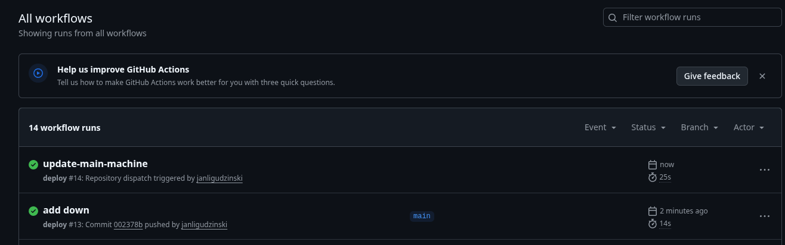

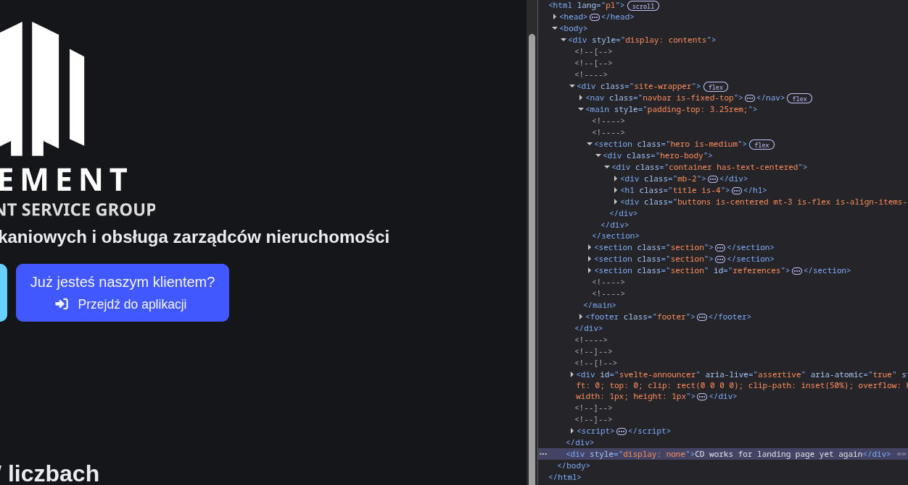

Woo! Obviously we immediately undo it to look professional and leave no trace of our experiments on a living organism.

### Civilizing our main project

You may have noticed we still don't have CI/CD for the main `goldenhand` project. That's because it will be the most complicated so far, the way it currently runs is a docker-compose roughly like this, pushed straight from the development environment:
```
db:
  - refers to postgres by image tag which is good
  - BUT has a volume local to this template for its data
  - exposes itself on the local host network
redis:
  - also just uses the image tag from docker.io
  - also has a volume
  - exposes itself on the local host network
backend:
  - depends on db and redis
  - builds from local dockerfile
  - env vars passed in inline to refer to db and redis
  - exposes itself on the local host network (so golem can reach it)
frontend:
  - depends on backend
  - builds locally
  - same story with env vars and host network
```

And the demo versions of the frontend and backend were initially run from a file *exactly like this* except `db` and `redis` are commented out and they point at those defined above by a `host.docker.internal` URL.

>*Did you find your CS degree in a bag of chips?*

Sometimes I ask myself the same question.

It's fine for them to have the same instance of the DB and Redis because each has its own logical database on the Postgres server and the things we put in the cache have unique IDs, but this is far from ideal. We will most likely have to take a gradual approach where we move out `frontend` and `backend` into their own composes (that refer to them as images from our registry instead of building locally). What would be closer to ideal is this:

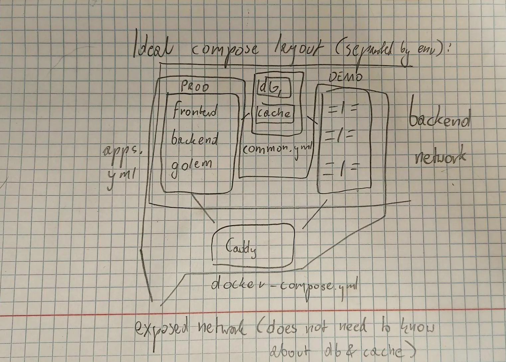

- let `db` and `redis` have their own compose project
- let `backend`, `frontend` and `golem` live in a shared `apps.yml`, of which we'll spawn a `prod` instance and a `demo` one with different env files
- `apps.yml` apps will see `db` and `redis` over a shared/"external" "backend" Docker network
- Caddy sees only `apps.yml` apps over a shared "webnet" network like the one we define now
- `db` and `redis`' volumes will also be `external` so we don't accidentally delete them

Let's start with making the backend and frontend containers get pushed to the registry in CI. Besides two basic `build` jobs for pull requests, discriminated by the paths of the changed files, we'll have this slightly more complicated `publish.yml` workflow:

```yaml
name: monorepo-publish
on:
  push:
    branches: [master]

jobs:
  changes: # We only want to build and publish the parts that have actually changed
    runs-on: ubuntu-latest
    outputs:
      backend: ${{ steps.filter.outputs.backend }}
      frontend: ${{ steps.filter.outputs.frontend }}
    steps:
      - uses: actions/checkout@v4
      - uses: dorny/paths-filter@v3
        id: filter
        with:
          filters: |
            backend:
              - backend/**
            frontend:
              - frontend/**

  build-backend:
    needs: changes
    if: needs.changes.outputs.backend == 'true' || needs.changes.outputs.common == 'true'
    runs-on: ubuntu-latest
    outputs:
      digest: ${{ steps.build.outputs.digest }}
    steps:
      - uses: actions/checkout@v4
      - uses: docker/setup-buildx-action@v3
      - uses: docker/login-action@v3
        with:
          registry: ghcr.io
          username: ${{ github.actor }}
          password: ${{ secrets.GITHUB_TOKEN }}
      - uses: docker/build-push-action@v6
        id: build
        with:
          context: ./backend
          file: ./backend/Dockerfile
          push: true
          tags: |
            ghcr.io/element-group-com-pl/goldenhand-backend:sha-${{ github.sha }}
            ghcr.io/element-group-com-pl/goldenhand-backend:latest
          cache-from: type=gha
          cache-to: type=gha,mode=max
          provenance: false

  build-frontend:
    needs: changes
    if: needs.changes.outputs.frontend == 'true' || needs.changes.outputs.common == 'true'
    runs-on: ubuntu-latest
    outputs:
      digest: ${{ steps.build.outputs.digest }}
    steps:
      - uses: actions/checkout@v4
      - uses: docker/setup-buildx-action@v3
      - uses: docker/login-action@v3
        with:
          registry: ghcr.io
          username: ${{ github.actor }}
          password: ${{ secrets.GITHUB_TOKEN }}
      - uses: docker/build-push-action@v6
        id: build
        with:
          context: ./frontend
          file: ./frontend/Dockerfile
          push: true
          tags: |
            ghcr.io/element-group-com-pl/goldenhand-frontend:sha-${{ github.sha }}
            ghcr.io/element-group-com-pl/goldenhand-frontend:latest
          cache-from: type=gha
          cache-to: type=gha,mode=max
          provenance: false

  promote-and-deploy:
    needs: [build-backend, build-frontend]
    runs-on: ubuntu-latest
    steps:
      - uses: docker/setup-buildx-action@v3
      - uses: docker/login-action@v3
        with:
          registry: ghcr.io
          username: ${{ github.actor }}
          password: ${{ secrets.GITHUB_TOKEN }}

      - name: Promote API to :release (if built)
        if: needs.build-backend.outputs.digest != ''
        run: |
          docker buildx imagetools create \
            -t ghcr.io/element-group-com-pl/goldenhand-backend:release \
            ghcr.io/element-group-com-pl/goldenhand-backend@${{ needs.build-backend.outputs.digest }}

      - name: Promote Frontend to :release (if built)
        if: needs.build-frontend.outputs.digest != ''
        run: |
          docker buildx imagetools create \
            -t ghcr.io/element-group-com-pl/goldenhand-frontend:release \
            ghcr.io/element-group-com-pl/goldenhand-frontend@${{ needs.build-frontend.outputs.digest }}

      - name: Trigger deploy
        uses: peter-evans/repository-dispatch@v3
        with:
          token: ${{ secrets.IAC_REPO_TOKEN }}
          repository: element-group-com-pl/element-iac
          event-type: update-main-machine
          client-payload: '{"service":"app"}'
```

While we're at it, we'll also alter the backend's Dockerfile to use the newest Rust (pinning only to its major version which will ~always be 1), cargo-chef and a separate runtime stage to bring it in line with golem:

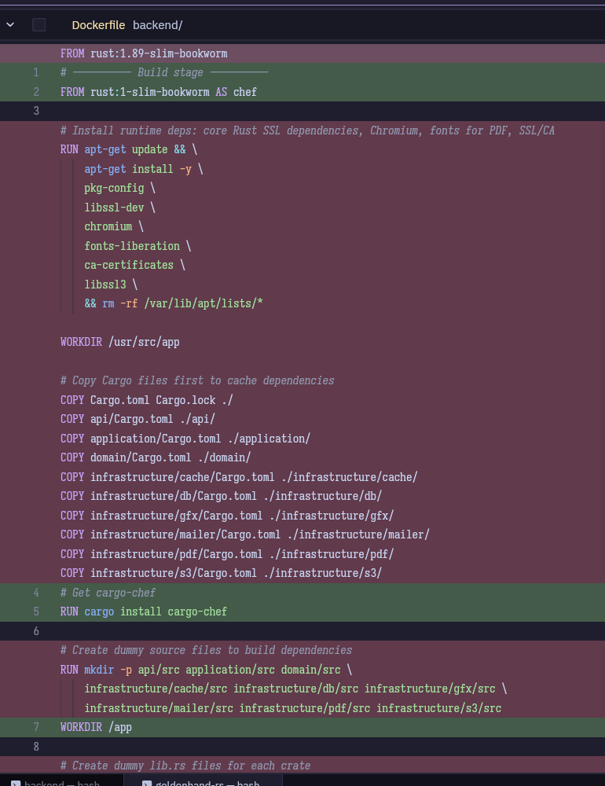

*Why bother with the cargo-chef thing if we still re-run the build from zero every time on Github?*

The docker-composes initially helped me develop things locally as much as deploy them, so having a quick rebuild loop was important - in fact, I might still want to manually check the image will build without errors before pulling the trigger and sending it out. Besides, haven't you seen how ugly our artisanal homegrown version of cargo-chef was?

Also, having a specific Rust minor version pinned has actually led to deploy errors in the past when I was using some new feature that had just dropped in stable, but my machine couldn't build it with the old compiler. Pinning to 1.\*.\* means we will basically never have to think about this again (and in fact might have a newer compiler there than on my machine). Let's push.

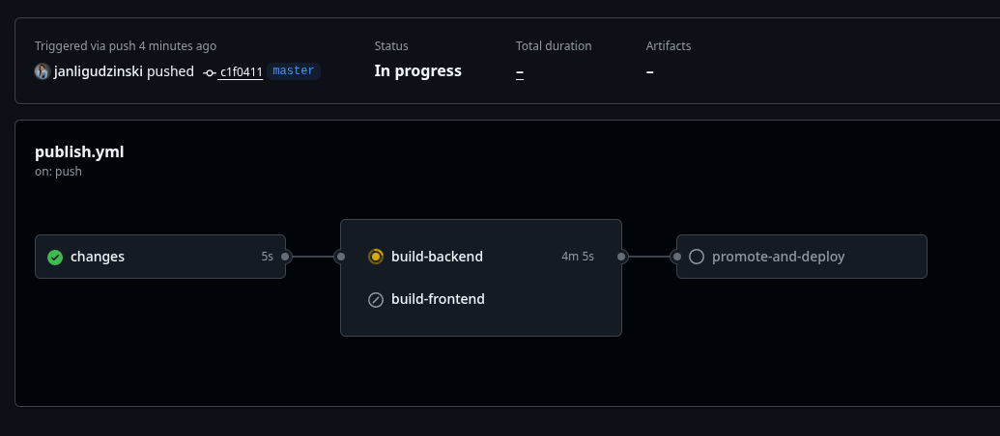

This is why I thought ahead to separate the backend and frontend build - a Serious (TM), Enterprisey (TM) Rust project of our scale with multiple build and run time dependencies does NOT build quickly from zero in release mode without cache on a free-tier machine.
This is actually *slower* than the previous flow which was part of why I kept putting off CI/CD for so long.

The internet speeds on GitHub runners and data-center machines are pretty sweet, though, always blows me away how fast the dependencies get downloaded when I watch a remote build.

Update after one run failed because I forgot to add the package-pushing permission and another because I forgot to set the IAC_REPO_TOKEN used at the very end: a full build takes 15 minutes on Github's provided runners. We must be missing some flag to actually use Github's cache properly; I'm told we can use our own registry as a cache:

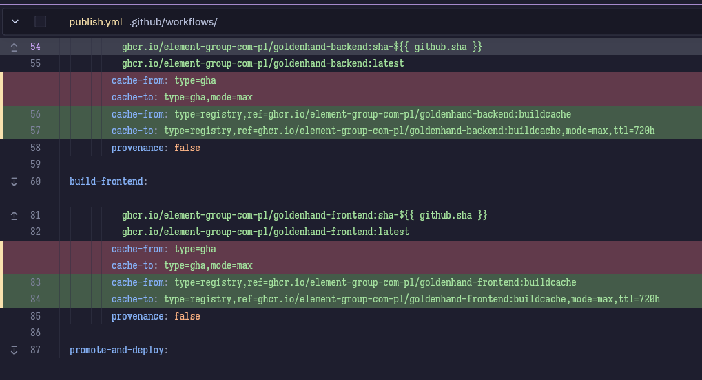

After another build upwards of 15 minutes let's retrigger the build with the cache this time:

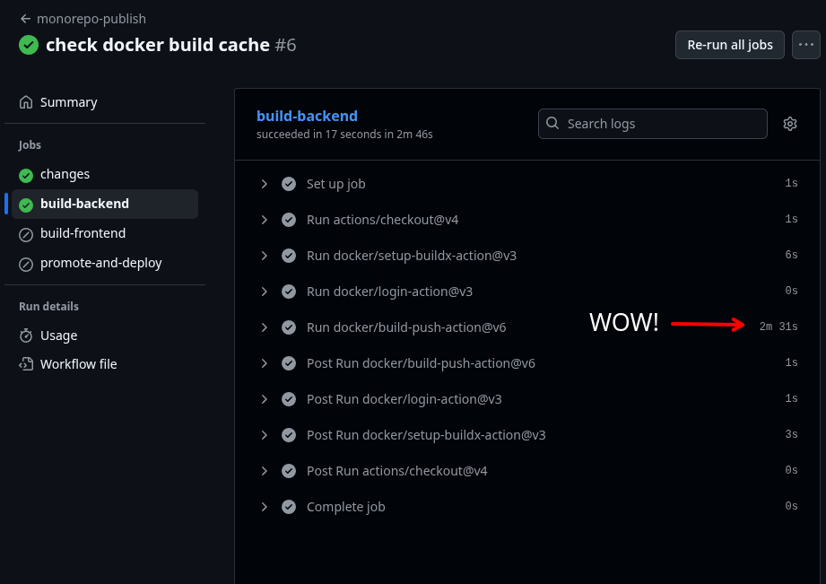

Two and a half minutes. Much better! We'll also apply this to `golem`. `landing-page` doesn't really need it - it very rarely changes, mostly when a new client drops and we want to boast about it.

While I was creating the "final", "totally final this time I swear", canonical compose layout, I also made the main `goldenhand` repo's publish job separately build the demo version of the frontend app and push it to the registry with a `release-demo` tag, as Angular environments are decided at compile time and we can't just swap in different env vars like we do with our backend containers.

Ultimately, in the IaC repo I ended up with a deploy script like this:

```bash
# Pre-create external Docker networks and volumes *if* they don't exist:
# - infra_net connects backend services to the DB and Redis
# - edge_net connects the reverse proxy to the backend services but doesn't know about DB/Redis
# - db_data is external because we want to copy data from an old named volume
# Idempotent create (quiet)
if docker network inspect infra_net >/dev/null 2>&1; then
  echo "Network infra_net already exists (good)"
else
  docker network create infra_net
fi
if docker network inspect edge_net >/dev/null 2>&1; then
  echo "Network edge_net already exists (good)"
else
  docker network create edge_net
fi

if docker volume inspect db_data >/dev/null 2>&1; then
  echo "Volume db_data already exists (good)"
else
  docker volume create db_data
fi

# Pull the latest images for the services defined in both docker-composes
docker-compose -f ./infra/docker-compose.yml pull
docker-compose -f ./apps/docker-compose.yml pull
docker-compose -f ./reverse-proxy/docker-compose.yml pull

# Stop and remove containers, networks, and volumes defined in docker-compose.yml
docker-compose -f ./infra/docker-compose.yml down
docker-compose -f ./apps/docker-compose.yml down
docker-compose -f ./reverse-proxy/docker-compose.yml down

# Start the services in detached mode (running in the background)
docker-compose -f ./infra/docker-compose.yml up -d
docker-compose -f ./apps/docker-compose.yml up -d
docker-compose -f ./reverse-proxy/docker-compose.yml up -d

```

### Other hiccups


After I finally managed to have the deploy pipeline pull my backend images, they were all bouncing my requests with a 502 and a `docker ps` showed they were constantly "restarting (101)". This was because up to this point we were doing our SeaORM migrations manually by passing the appropriate `DATABASE_URL` as an env var *before* deploying the new code...

>*💀💀💀💀💀💀💀💀💀*

...so now the seeding jobs that run on startup were crashing out because a table wasn't present yet. I added this to my DB layer code to run on startup after I get a DB connection:

```rust
#![allow(async_fn_in_trait)]
#[allow(unused_imports)]
pub(crate) mod entities;

#[allow(unused_imports)]
pub mod migrator;
pub mod repositories;
pub mod seeding;

pub async fn run_migrations(db: &sea_orm::DatabaseConnection) {
    log::info!("Running database migrations...");
    use migrator::Migrator;
    use sea_orm_migration::MigratorTrait;
    Migrator::up(db, None).await.unwrap();
    log::info!("Database migrations complete.");
}
```

Also, I think this is probably the first time we see any Rust in this series despite the system's most important piece being built in it.
Anyway, after I established that the API would start up correctly, I took everything but the DB down for a while, copied over the dump from the old one, re-ran the deploy pipeline, and we've done it. We've restored the system to its previous state (thank fuck we're a small business with few users), my usual login and password remembered in the browser worked right away, and I think in coming posts we'll be free to focus on uncluttering the code itself.

### More fuckups

One component of our backend sub-system relies on Chromium: we generate some standardized documents as styled HTML pretending to be an A4 sheet of paper, launch a headless Chromium, make it open the HTML and spit it out as a PDF. When I deployed this code, the change to cargo-chef and a separate runtime stage caused two bugs:

- first, trivial, the API's PDF methods returned a 500 saying the HTML templates couldn't be found
  - this was simply because the final image didn't have the whole source code anymore, so all I needed to do was to copy the `ASSETS_DIR` directory from `src/infrastructure/pdf` and point the app at it with the appropriate env var
- second, less trivial: after fixing the former bug, calling them caused the whole API to become unresponsive with Docker being none the wiser and just saying it was "up(unhealthy)" in `docker ps`
  - upon investigation, this was most likely because the `rust` images come with a full home directory/common env vars for the running user set up, so Chromium could write the config files it normally expects to create; by contrast the runtime `debian:bookworm-slim` image, which we now copy our executable and into and in which we still install Chromium and fonts, is way more barebones and when I checked the logs, Chromium was just endlessly restarting with the Rust side of the library waiting for it to stabilize forever.

  I fixed this with the following lines:
  ```dockerfile
  # Create dirs for Chromium (idempotent; assumes user/group already exist)
  RUN mkdir -p /home/nonroot
  RUN mkdir -p /tmp/runtime-dir

  ENV HOME=/home/nonroot
  ENV XDG_RUNTIME_DIR=/tmp/runtime-dir


  ENV HOME=/home/nonroot
  ENV XDG_RUNTIME_DIR=/tmp/runtime-dir
  ENV CHROME_PATH=/usr/bin/chromium
  ```


>*Wait, just one more thing, why the compose down all this time?*

And here you find out just how embarrassingly out of the loop I'd been before undertaking this effort. It turns out that `docker-compose` is deprecated for `docker compose` which are two completely different packages. I'd been using the former on the Ubuntu server, where the `docker-compose` package name still refers to this old hyphenated one, unlike my Arch dev box where it's the new one (and aliases the old `docker-compose` command to itself). That is why, when I was first deploying manually, I noticed that running `docker-compose up -d` when containers were already up resulted in a bunch of cryptic Python errors about `ContainerConfig` and such filling the screen, and in this way I developed my inefficient, excessive-downtime-incurring flow of always `down`ing everything before bringing it back up. It *worked*, so I got used to it, kind of like maybe a habit of resetting the whole computer with the hardware button if the browser freezes.

>*💀💀💀*

Bind a hotkey to the skull emoji, it's going to be your new favorite one.

Let me fix that right quick:

```
Last login: Mon Oct 13 07:42:21 2025 from 46.134.87.202
root@ubuntu-8gb-fsn1-1:~# apt search docker compose
Sorting... Done
Full Text Search... Done
docker-buildx/noble-updates 0.21.3-0ubuntu1~24.04.1 amd64
  Docker CLI plugin for extended build capabilities with BuildKit

docker-compose/noble,now 1.29.2-6ubuntu1 all [installed]
  define and run multi-container Docker applications with YAML

docker-compose-v2/noble-updates 2.37.1+ds1-0ubuntu2~24.04.1 amd64 <----- THIS IS WHAT WE SHOULD HAVE GOTTEN
  tool for running multi-container applications on Docker

podman-compose/noble 1.0.6-1 all
  Run docker-compose.yml using podman

python3-ck/noble 1.9.4-1.1 all
  Python3 light-weight knowledge manager

python3-compose/noble,now 1.29.2-6ubuntu1 all [installed,automatic]
  Python implementation of docker-compose file specification

resource-agents-extra/noble 1:4.13.0-1ubuntu4 amd64
  Cluster Resource Agents

root@ubuntu-8gb-fsn1-1:~# apt install docker-compose-v2
```

And our deploy script can now look like this:

```bash
# Pull the latest images for the services defined in docker-composes
docker compose -f ./infra/docker-compose.yml pull
docker compose -f ./apps/docker-compose.yml pull
docker compose -f ./reverse-proxy/docker-compose.yml pull

# Start the services in detached mode (running in the background)
docker compose -f ./infra/docker-compose.yml up -d
docker compose -f ./apps/docker-compose.yml up -d
docker compose -f ./reverse-proxy/docker-compose.yml up -d
```

## Takeaways

- Proper CI/CD is **painful** to implement after a project has gotten complex and has multiple moving parts. Just do it right away, like, immediately, no excuses.
- Ditto for DB migration flows: they should be automated so they follow from the above.
- Monorepos are actually kind of painful to set up for CI/CD. Maybe this would not be such a problem if I'd picked a backend language with a less drastic average compile time.
  - On the other hand, we've actually got a cache now, so we could maybe afford to just indiscriminately "build" both images. Food for thought.
  - Speaking of compile times, we might have to take a look at optimizing our Angular app's builds. Maybe try to use Bun as the runtime?
- Spinning off the fact that on Arch I never knew the difference between hyphenated and spaced compose, it pays off to be familiar with your actual deployment environment (I haven't used Ubuntu or its spin-offs since middle school).

I don't think we'll be able to fit blue/green deployments into this post, I'm tired and so are you, though they are still a high priority as downtime is to be avoided. In the next posts however we might get around to code changes and refactoring, and in the meantime we'll avoid deploying to prod too often by employing a separate `develop` branch to merge to.


[^1]: Behind the scenes: Traefik was also a possible solution, since it's apparently ready out of the box for our use case of routing to multiple Docker containers, but Caddy's easy one-file config won out over the massive *ENTERPRISE-GRADE (TM)* combine that isn't specialized to do a single thing describable in one sentence. Also, I can see a way I could use Caddy locally for development when I need HTTPS for something (currently, we have a compile-time switch that makes the API serve over HTTPS in development; outsourcing that concern to Caddy would mean we get to delete code, which is what every developer loves most).
[^2]: The early prototype I'd built in C#, before the Realtime API had even dropped in general availability, functioned purely over multiple HTTP requests where Twilio would call a "start_call" endpoint and we'd respond with a TwiML `<Gather>` asking it to collect user audio and give us a text transcription at another endpoint, "advance_conversation", which then responded with a `<Say>` containing the LLM's response and another `<Gather>` asking to do the same thing again. In between the different requests we'd store the conversation state in Redis. Currently, as the conversation is a persistent connection, we can do this stuff in memory (and as the LLM can use MCP tools we expose like "hang up", we also don't need to do hacky things like asking the LLM to output a blob of everything-JSON containing its next sentence, a "conversation should end" flag, etc).
[^3]: [This thing](https://github.com/getsops/sops). Supposedly it's made by Mozilla.
