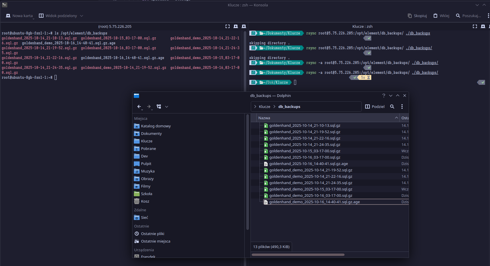
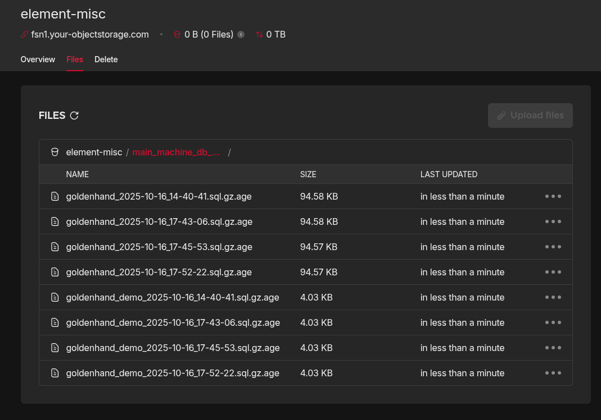
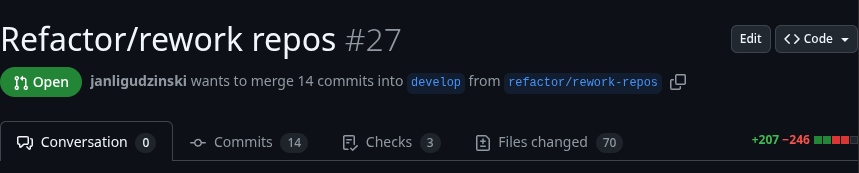
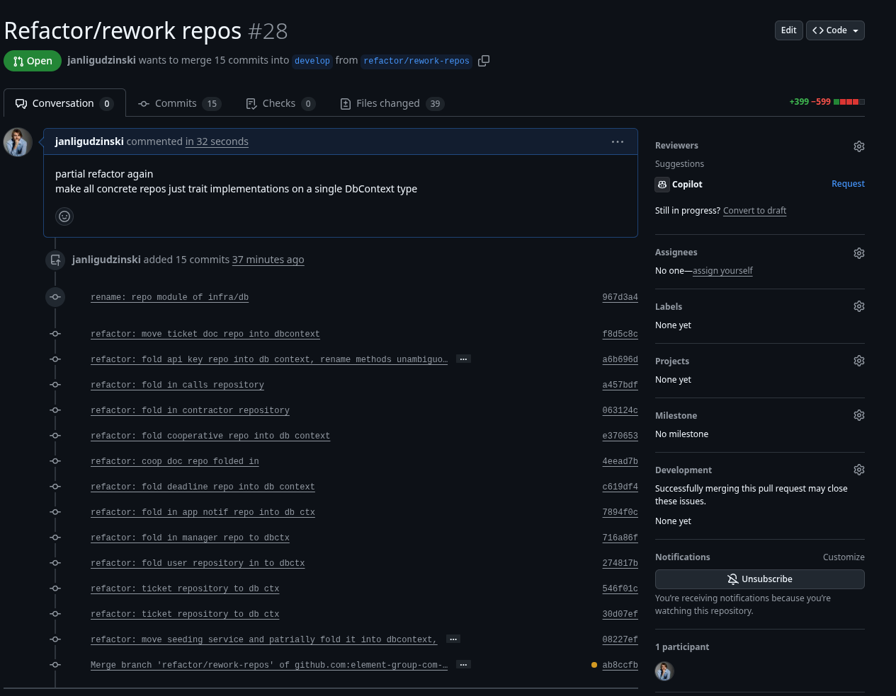
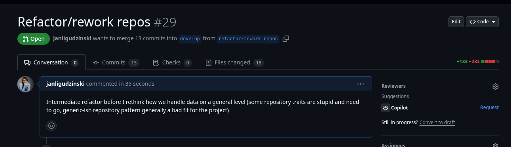

+++
authors = ["Jan Ligudziński"]
title = "In which I fix a nasty production system: #3 - Backend refactoring, part 1"
description = "Cargo-culting C# projects from work was a bad idea."
date = 2025-10-17
[taxonomies]
tags = ["nasty system", "programming", "rust", "war story", "refactoring"]
+++

## Where we left off

In the [previous post](/blog/2-nasty-system-2) we finished building a complete CI and CD pipeline for our project - things get built before they are merged into master, and when they are they not only get built but also pushed to production, with a Github "runner" on our server that connects to Github and waits for orders to reinstall things.
Two more things we can do before we continue with refactoring the system:
- let's have our `demo` environment run builds from the `develop` branch where we will put the newest features - the demo environment, in our two-man practice, is as much for (rare) demos before clients as it is for running things past the CEO (also rarely). I don't think a dedicated `dev` environment, subdomain, and so on, are justified quite yet - if I'm actively developing something, it stays on my machine anyway.
- let's have our `db` automatically back itself up - let's say to a file on the server - once a day.

## DB backups

I asked GPT to generate me a periodic job to run in the same Compose file as the DB to back it up to files mounted on the machine. What it gave me I then manually edited to remove excess parameterization, reuse the env file we already pass to the database itself, and be its own Dockerfile and shell scripts instead of a disgusting inline YAML string. What it does is:

- once a day, at a parameterizable hour (around 03:15 Warsaw time - even I'm probably not doing anything then), it runs `pg_dump` for every logical database on our Postgres server that we care to track
- this is done with cron calling a separate backup script
- which is also called once at container startup, so we know it's working right away
- the backups are stored in a mounted volume on the host machine, in a directory we can easily access
- the backups roll over after a week, which I think is plenty of time. Considering that our production DB's dump weighs about 600KB at the time of writing these words at the time of operation, we could go absolutely insane and store a month's worth or capture the backups more often, but I don't see the need for it.

Behold:

```yaml
db:
  image: postgres:15-alpine
  networks:
    infra_net:
      aliases: [db]
  env_file: /opt/element/env/db/.env
  ports:
    - "5432:5432" # we definitely want host access (through an SSH tunnel ofc)
  volumes:
    - db_data:/var/lib/postgresql/data
    - /opt/element/env/db/initdb:/docker-entrypoint-initdb.d # this will only run when the volume is empty, btw
db_backup:
  build:
    context: ./db_backup
    dockerfile: Dockerfile
  networks: [infra_net]
  environment:
    DBS: "goldenhand goldenhand_demo"
    RUN_AT: "03:17"
    TZ: "Europe/Warsaw"
  env_file: /opt/element/env/db/.env
  volumes:
    - /opt/element/db_backups:/app/backups
```

```Dockerfile
FROM alpine:3

RUN apk add --no-cache postgresql-client tzdata bash coreutils findutils >/dev/null
COPY backup.sh /app/backup.sh
COPY run.sh /app/run.sh
RUN chmod +x /app/run.sh
RUN chmod +x /app/backup.sh

WORKDIR /app
ENTRYPOINT ["/app/run.sh"]
```

```bash
# run.sh:
#!/usr/bin/env bash
set -euo pipefail

: "${RUN_AT:?Set RUN_AT like HH:MM}"
: "${DBS:?Set DBS (space-separated database names)}"

# Map to PG* if not set
: "${PGUSER:=${POSTGRES_USER:-}}"
: "${PGPASSWORD:=${POSTGRES_PASSWORD:-}}"
: "${PGHOST:=db}"
: "${PGPORT:=5432}"
export PGPASSWORD
mkdir -p /app/backups

# Build a minimal crontab entry
H="${RUN_AT%:*}"
M="${RUN_AT#*:}"

# Write crontab (to user’s crontab path on Alpine)
CRON_FILE="${HOME}/crontab"
CRON_ENV="DBS='${DBS}' PGHOST='${PGHOST}' PGPORT='${PGPORT}' PGUSER='${PGUSER}' PGPASSWORD='${PGPASSWORD}'"
echo "${M} ${H} * * * ${CRON_ENV} /app/backup.sh >> ${HOME}/cron.log 2>&1" > "$CRON_FILE"

# Install crontab
crontab "$CRON_FILE"

echo "[pgbackup] Running initial backup now..."
/app/backup.sh || true
echo "[pgbackup] Scheduled daily at ${RUN_AT} ${TZ:-UTC}"

# Run cron in foreground so the container stays up
# busybox crond is already present; -f stays in foreground, -l 8 is verbose
touch /var/log/cron.log
exec crond -f -l 8

# backup.sh:
#!/usr/bin/env bash
set -euo pipefail
: "${DBS:?missing DBS}"

: "${PGUSER:=${POSTGRES_USER}}"
: "${PGPASSWORD:=${POSTGRES_PASSWORD}}"
: "${PGHOST:=db}"
: "${PGPORT:=5432}"
export PGPASSWORD

# wait for DB to be ready (check the first DB name)
first_db="${DBS%% *}"
until pg_isready -h "${PGHOST:-db}" -p "${PGPORT:-5432}" -U "${PGUSER:-postgres}" -d "$first_db" >/dev/null 2>&1; do
  echo "[backup] waiting for database..."
  sleep 2
done

ts="$(date +%F_%H-%M-%S)"
failures=0

# robust split
IFS=' ' read -r -a dbs <<< "$DBS"

for d in "${dbs[@]}"; do
  [ -z "$d" ] && continue
  out="/app/backups/${d}_${ts}.sql.gz"
  echo "[backup] dumping ${d} -> ${out}"
  if ! pg_dump -h "$PGHOST" -p "$PGPORT" -U "$PGUSER" -d "$d" --no-owner --no-privileges | gzip -9 > "$out"; then
    echo "[backup][ERROR] pg_dump failed for ${d}" >&2
    failures=1
  fi
done

echo "[backup] pruning files older than 7 days"
find /app/backups -type f -name "*.sql.gz" -mtime +6 -print -delete || true

if [ "$failures" -ne 0 ]; then
  echo "[backup] finished with errors" >&2
  exit 1
fi
echo "[backup] done"

```

While this approach is not perfect - we still don't exfiltrate the dumps outside of our machine right away - it's better than what we had up to now, that is to say, *nothing* but my due diligence. And that only occasionally.

>*💀💀💀*

*Yeah*. Now that I've slept on this, considering that we have an S3-clone bucket bought already, it might be a good idea to upload the dumps there as well in case the machine ever goes poof. It's also not best practice and probably not legal to get it out unencrypted (or even store it unencrypted at rest), so we might have to use `age` after all - generate a key pair on our dev box, then put the public, encrypt-only key on the server (we can even commit it to the repo). Pipe the dumps through it before saving and uploading, if we need to get them out then I can decrypt locally with the private key I have; maybe even print it out on paper in case it's *my* computer that buys the farm.

### Adding encryption

Let's install `age` on my computer with `yay -Syu age` and also add it to the backup container's `run apk add ...` line, then generate the key:

```
~/Dokumenty/Klucze$ age-keygen -o db_backup_key.txt
age-keygen: warning: writing secret key to a world-readable file [non-issue, I don't let other machines or people onto my own computer]
Public key: age1sae4n3twedp6dfxls4fu436z5h0cgwkzrgv2qvj4j6fexvdzvsfq9z47h0 [I can just show you this, what are you gonna do? Encrypt files that only I will be able to decrypt?]
```

```yaml
# ...
db_backup:
    build:
      context: ./db_backup
      dockerfile: Dockerfile
    networks: [infra_net]
    environment:
      AGE_PUBLIC_KEY: age1sae4n3twedp6dfxls4fu436z5h0cgwkzrgv2qvj4j6fexvdzvsfq9z47h0 # dw, safe to commit
# ...
```

```bash
#...
: "${AGE_PUBLIC_KEY:?missing AGE_PUBLIC_KEY}"
#...
out="/app/backups/${d}_${ts}.sql.gz"
out_enc="${out}.age"
echo "[backup] dumping ${d} -> ${out_enc}"
if ! pg_dump -h "$PGHOST" -p "$PGPORT" -U "$PGUSER" -d "$d" --no-owner --no-privileges | gzip -9 | age -r ${AGE_PUBLIC_KEY} > ${out_enc}; then
  echo "[backup][ERROR] pg_dump failed for ${d}" >&2
  failures=1
fi
#...
```

Note that we *first* compress the dump, *then* encrypt it - encrypted data looks much more random than a very repetitive SQL file with lots of `INSERT INTO ...` boilerplate or the same IDs cropping up in multiple places, and so is not going to compress well. We also pipe everything up to `out_enc` so at no point do we write the unencrypted dump to disk.



All that's left is to delete the plain `.sql.gz` files.

```
root@ubuntu-8gb-fsn1-1:~# rm /opt/element/db_backups/*.sql.gz
root@ubuntu-8gb-fsn1-1:~# ls /opt/element/db_backups
goldenhand_2025-10-16_14-40-41.sql.gz.age  goldenhand_demo_2025-10-16_14-40-41.sql.gz.age
```

Let's now peek into the files locally:
```
head -c 200 goldenhand_2025*.age
age-encryption.org/v1
-> X25519 lzFBWTPW1t7z6yy6u5DRAy/rLp1n+8Ccw7SBniJW3Wg
e8rGY5FMJ8c6LxTUjbbMlzVE4YeVsvSyuk9/3A5MIGc
--- 8eUblsOQoFHrmTO/BSsKVIPBOu02gtLS7igt4WYPs/E
�L����f�s�▒X�~u���l�����mh�>%

cat goldenhand_2025*.age | age --decrypt -i ~/Dokumenty/Klucze/db_backup_key.txt | gzip -d > demo_dump_decrypted.sql

head -c 200 demo_dump_decrypted.sql
--
-- PostgreSQL database dump
--

\restrict dRwWcw4f7HDYqYbqHqg67shjZrwzrFEeZFjrmax50JUM2zm1FqFHE00nSgbbz1k

-- Dumped from database version 15.14
-- Dumped by pg_dump version 17.6

SET statement_tim%
```

Yeah, this works all right.

### Syncing to S3

Finally, let's upload the dumps to our Hetzner S3. I just had to manually create the `element-misc` bucket where we'll throw these backups and maybe other things of a similar nature if there's a need, and we can reuse our existing project-level credentials; finer-grained permissions aren't offered.

We'll add `rclone` to the container, which is like `rsync` but for S3 and not ssh - a CLI tool that syncs the state of a physical machine's directory with the contents of a bucket. Thankfully it's in the Alpine Linux repo, so once again we just add it to the `apk add` line.

The S3 keys, unlike my backup script's public key, actually need to be secret, so I'll pass them in the untracked .env file the backup script already uses as we have done so far. The 5 variables to include are `S3_ACCESS_KEY_ID`, `S3_SECRET_ACCESS_KEY`, `S3_BUCKET`, `S3_REGION` and `S3_ENDPOINT`), with an `RCLONE_` prefix for `rclone` to pick them up automatically as told by the inline `env_auth` flag (except `BUCKET` which has to be passed explicitly, but I'll keep the RCLONE_ for consistency):

```bash
# backup.sh
# ... (exit early if something goes wrong)
echo "[backup] syncing to S3"

rclone sync /app/backups ":s3,env_auth:/${RCLONE_S3_BUCKET}/main_machine_db_backups/"

echo "[backup] done"
```



As we've now also established that the backup job does in fact fire at 03:17 when I've likely already gone to sleep and my users definitely have, we can cut out the line of `run.sh` that runs `backup.sh` once regardless of timing at startup as well.

>*Why 03:17?*

There is this superstition around from the bad old days of everyone sharing compute on not just the same physical server but the same multi-user OS without virtualization that because everyone instinctively uses round hours that end in 0 or 5 for their regular jobs, those times are when the server is busy with everyone's work and your own will be slower for it, so you should pick odd, irregular-looking times to have more CPU time and RAM to yourself. This is likely a non-issue in the big AD 2025, but is a good practice in case we undergo a civilizational collapse that sets us back to managed PHP[^1] hosting, or, worse, Java servlets on Tomcat[^2].

## Separate deploys for prod and demo

Moving on, let's divorce `prod` from `demo` in our CI/CD pipeline - a push to `develop` should make a different tag in our registry than a push to `master` or `main`, and in fact we already kind of do this, though the `frontend:release-demo` image is still built from the master branch and in sync with it. What's more, with our recent switch from Docker Compose v1 to v2, we can indiscriminately `up -d` with only the containers that have actually changed and been pulled anew getting downed first, so all we really need to do is conditionally switch the tag in our registry pushing action and use that tag in `apps.docker-compose.yml`.
This will look roughly like this:

```yaml
- name: Promote API to :release or :release-demo (if built)
        if: needs.build-backend.outputs.digest != ''
        run: |
          docker buildx imagetools create \
            -t ghcr.io/element-group-com-pl/goldenhand-backend:${{ github.ref_name == 'develop' && 'release-demo' || 'release' }} \
            ghcr.io/element-group-com-pl/goldenhand-backend@${{ needs.build-backend.outputs.digest }}
```

With logic like this, switching on the branch name that's been pushed to, we can even get rid of the ugly separate jobs for building and pushing the frontend image's demo version:

```yaml
#...
build-args: |
            BUILD_CONFIGURATION=${{ github.ref_name == 'develop' && 'demo' || 'production' }}
#...
```

## Actually refactoring

With all of the grimy deployment stuff out of the way, let's go into how botched my implementation of DDD-ish/clean-architecture-ish concepts was in this project and why.

### Rampant, cruel abuse of the repository pattern

I think the single biggest blunder is the way I decided to cargo-cult the generic repository pattern from the C# world (considered harmful even there by some). When you can just expose Entity Framework's `IQueryable<T>`, get to map directly to your domain objects, modify those in place in memory then call `SaveChanges()` and have the diffs magically applied to the DB, you can get away with being very lazy with how you plan out your CRUD operations. I learned this as an impressionable junior and didn't stop to consider that:

- one, this is a leaky abstraction which makes the application-level commands and queries need to know how the persistence layer works on the EF side
- and two, since we define the actual capabilities of our application on the eponymous layer, the repositories shouldn't be defined with the domain. How they got there at the particular workplace that taught me the pattern, I don't know; perhaps this was a leftover from "domain services" orchestrating saving data themselves (bad!)? I think there might have been some audit log/versioned entity shenanigans going on as well, which could also explain it.

Rust doesn't really have anything like EF in its offering of ORMs - the language's design is not very conducive to it, as you'd need your equivalent of the `DbContext` to always have a reference to the entities you've pulled, which wouldn't let you mutably do anything with them unless you used certain synchronization wrappers... etc, etc, not worth the bother. So, I was thankfully railroaded into defining specific repository traits for all of our business entities, but still they are not quite up to snuff. Why?

The specific Cee-Sharpish repository (anti-?)pattern we use here was intended, I think, for very repeatable, easily abstractable create/read/update/delete operations on concrete, complete entities, where we don't really need to pull out partial views or ask complex questions with short answers. Take for example the seeding procedure when my app first starts. Obviously, only an admin should be allowed to modify the list of clients, contractors, and clients' buildings, so before we start actually using the app we need there to be one, and we can't just let any random schmuck click himself into the job as soon as the API and frontend are up. Therefore, we have an initial username and password[^3] stored secretly in an environment variable and at startup ask these questions:
- is there already anything in the `administrators` table (we use role-tables like this to bind capabilities to actual `users`)...
  - ...where `user_id` matches an active user?
(If yes, do nothing, if not, create a new user with the given username and password and give them an admin role.)
This is a very specific query that can be perfectly well answered in an SQL one-liner: `SELECT TRUE as active_admin_exists FROM administrators a JOIN users u ON a.user_id = u.id WHERE u.is_active = TRUE` - but it doesn't map well to the generic repository pattern we have, and when I was formulating it months ago I think I must have had an inkling of how ridiculous it would have been for an `async fn check_if_administrator_exists(&self) -> Result<bool, RepositoryError>` method to be in there among `get_all`, `create` and so on, because I don't see one, but we do do shit like this:

```rust
async fn seed_initial_data(&self) {
    self.seeding_service.seed().await.unwrap();
    // TODO: move this to seeding service, or remove that service and make this modular
    // Set up admin account if not already set up.

    let query = GetAllActiveUsersQuery;
    let users = query.handle(&self.user_repository).await.unwrap();

    if users
        .iter()
        .any(|user| user.roles.contains(&UserRole::Administrator))
    {
        eprintln!("At least one admin account already exists. Aborting seeding.");
        return;
    }
```

>*💀💀💀*

Yeah, this client-side filtering is retarded and I'm pretty sure it was vibe-coded overnight. Thankfully it only runs once at application startup and the volume of data is negligible. There's another dumb "repository-like" trait that took me some time to find while refactoring, much closer to what I described earlier:

```rust
pub trait DatabaseSeeder {
    async fn ensure_counter_exists(&self) -> Result<(), RepositoryError>;
}
```

(What happens here is that every time we take or make a new request for work to be done - a "work ticket" in our domain language - we give it a new sequential number. I originally thought we'd possibly have different number schemes or letter prefixes for different customers, so I made a separate `counter` table, then requirements got clarified and we count tickets globally and indiscriminately, however, the transactions used in ticket creations still expect one row with the current number to exist so they can grab and increment it.)

>*What a business analyst you are!*

Also, to really beat the nail into my coffin, compare these two concrete repositories and how they're instantiated:

```rust
#[derive(Clone)]
pub struct SeaOrmWorkTicketRepository {
    db: DatabaseConnection,
}
#[derive(Clone)]
pub struct SeaOrmManagerRepository {
    db: DatabaseConnection,
}

// ...
let cooperative_repository = SeaOrmCooperativeRepository::new(db.clone());
let ticket_repository = SeaOrmWorkTicketRepository::new(db.clone());
let user_repository = SeaOrmUserRepository::new(db.clone());
let contractor_repository = SeaContractorRepository::new(db.clone());
let deadline_repository = SeaOrmDeadlineRepository::new(db.clone());
let manager_repository = SeaOrmManagerRepository::new(db.clone());
let database_seeder = SeaOrmDatabaseSeeder::new(db.clone());
let cooperative_doc_repository = SeaOrmCooperativeDocumentRepository::new(db.clone());
let ticket_doc_repository = SeaOrmTicketDocumentRepository::new(db.clone());

let state = Self {
    user_repository: user_repository_for_state,
    session_store: session_store_for_state,
    password_reset_token_store,
    contractor_repository,
    deadline_repository,
    manager_repository,
    seeding_service,
    storage,
    cooperative_document_repository: cooperative_doc_repository,
    ticket_document_repository: ticket_doc_repository,
    pdf_generator,
    ticket_repository,
    cooperative_repository,
    mailer,
    event_publisher: ChannelEventPublisher::new(),
    thumbnail_service: ImageCrateThumbnailService,
    in_app_notification_repository: SeaOrmInAppNotificationRepository::new(db.clone()),
    api_key_repo: SeaOrmApiKeyRepository::new(db.clone()),
    calls_repo: SeaOrmPhoneCallRepository::new(db.clone()),
};
```

These types are completely identical under the hood and in fact share the exact same inner connection pool instance. I need to be publicly stoned, like with rocks, not weed.

>*Yes.*

Also, you can very easily see which repos are more recent additions.

The solution I have in mind right now, long term, will be to do away with the repository pattern entirely in favor of hexagonal architecture's more abstract concept of *ports* - interfaces very specific to the application operations they enable. Thus we might get for example a `UserReadQueries` port that lets us `async fn admin_already_exists(&self) -> Result<bool, ApplicationError>` among other operations, whose name does not suggest the strict CRUD quadrinity (not sure if that's a real word, the Greek "tetrad" can work as well if it isn't) that `UserRepository` does.

The short term one I can do right away is to move the repository traits up to the application layer and consolidate their concrete implementation in one `DbContext` struct we'll shamelessly crib from EF's one with the different per-entity traits standing in for an EF context's `DbSet<T>` properties. The `State` could easily be slimmed down to:

```rust
let state = Self {
    db_context,
    session_store: session_store_for_state,
    password_reset_token_store,
    seeding_service,
    storage,
    pdf_generator,
    mailer,
    event_publisher: ChannelEventPublisher::new(),
    thumbnail_service: ImageCrateThumbnailService,
};
```

I'm a one-man IT department but just for the sake of tracking changes and showing you the impact, I made a PR for the branch where I moved the repository traits (and the associated error type) to the application layer where they are actually needed:



39 lines down, nice. One of these was a completely unrelated fix to CI, btw. Let's see how many lines we'll save by consolidating the implementations:



Now we're cooking, 200 lines thrown out and more to come. You see, our application-level command and query handlers work in a particularly egregious case like this:

```rust
pub struct SavePhoneCallCommand {
    pub id: Uuid,
    pub caller_number: String,
    pub started_at: chrono::DateTime<chrono::Utc>,
    pub ended_at: chrono::DateTime<chrono::Utc>,
    pub relevant: bool,
    pub human_contact_requested: bool,
    pub cooperative_id: Option<Uuid>,
    pub apartment_number: Option<String>,
    pub title: String,
    pub summary: String,
    pub transcript: CallTranscript,
}
impl SavePhoneCallCommand {
pub async fn handle(
    &self,
    repository: &impl PhoneCallRepository,
    coop_repo: &impl CooperativeRepository,
    user_repository: &impl UserRepository,
    ticket_repository: &impl WorkTicketRepository,
    event_publisher: &impl EventPublisher,
) -> Result<PhoneCallDto, ApplicationError> {
// ...
```

Resulting in calls like this in the API/presentation layer now:

```rust
#[axum::debug_handler]
async fn save_call(
    State(state): State<AppState>,
    _api_key: AdminApiKey,
    Json(payload): Json<SavePhoneCallRequest>,
) -> Result<Json<PhoneCallDto>, ApiError> {
    let command = SavePhoneCallCommand::new(payload);
    let call = command
        .handle(
            &state.db_context,
            &state.db_context,
            &state.db_context,
            &state.db_context,
            &state.event_publisher,
        )
        .await?;
    Ok(Json(call))
}
```

This is *slightly* preferable to before, where we had to pass in separate instances (of the same damn thing), but really not great. So we could do the following:

```rust
pub struct TicketEventProcessor<
    Repos: WorkTicketRepository + UserRepository + InAppNotificationRepository,
> {
    notification_service: NotificationService<Repos>,
    repos: Repos,
}
```

The `+` lets us specify that we want to have something that implements multiple traits. However, this gets unwieldy in `impl` blocks:

```rust
impl<Repos: WorkTicketRepository + UserRepository + InAppNotificationRepository>
    TicketEventProcessor<Repos>
{
  // ...
```

And also - which is ultimately a symptom of the bigger smell of the repository pattern as we use it - the traits often have overlapping method names, like `get_by_id`, which requires us to disambiguate like this:

```rust
async fn handle_ticket_comment_added(
    &self,
    event: TicketCommentAddedEvent,
) -> Result<(), ApplicationError> {
    let ticket = WorkTicketRepository::get_by_id(&self.repos, &event.ticket_id)
        .await?
        .ok_or(ApplicationError::NonexistentEntity(
            "ticket",
            event.ticket_id.clone(),
        ))?;
    let commenter = UserRepository::get_by_id(&self.repos, &event.author_id)
        .await?
        .ok_or(ApplicationError::NonexistentEntity(
            "user",
            event.author_id.clone(),
        ))?;
    // ...
```

I don't think we can fix the latter without radically renaming the methods or rethinking the pattern entirely - which I do want to do - but we might be able to do something about the former:

```rust
type Repos = impl WorkTicketRepository + UserRepository + InAppNotificationRepository;
```

Actually, no, that won't compile as this feature isn't stable yet and the issue is still under discussion. Still, this is arguably a net win, as this persistent "event processor" is one of the few places we actually need something to own such a generic multi-type; the individual command handlers will be able to just take in one DbContext as an inline `&impl WorkTicketRepository + UserRepository ...` param.
One thing Copilot autocomplete suggested was a newtype wrapper, like `WorkTicketRepositoryWrapper(pub impl WorkTicketRepository)` I guess, but it'd be about equally ugly in my opinion.

```rust
impl GetTicketByIdWithRelationsQuery {
    pub async fn handle(
        &self,
        repos: &(impl WorkTicketRepository + TicketDocumentRepository),
    ) -> Result<Option<WorkTicketWithRelations>, ApplicationError> {
        let mut ticket = match repos.get_by_id_with_relations(&self.id).await? {
            Some(ticket) => ticket,
            None => return Ok(None),
        };
        let images = repos.get_images_for_ticket(&self.id).await?;
        ticket.images = images;
        Ok(Some(ticket))
    }
}
```

(Another bad design decision here: a "ticket with relations" is just a ticket DTO with all its subordinate entities (images, comments) pulled in. This could be one query named after its actual purpose, something like `TicketFullViewQuery`, too.)

We actually have to use parentheses here if we want to avoid the compiler yelling at us; this is ungainly, especially when we run into the methods with overlapping names, but the ungainliness itself is a sign that we're doing something wrong on a design level here. "Documents" are simply any files attached to tickets or "cooperatives"[^4], possibly viewable multimedia like pictures. There are two nearly identical tables for each kind, with the ticket-specific one also containing a thumbnail link as the usual use case for ticket documents is photos of things that need to be fixed (from the customers) and visual progress reports (from us) so we want to neatly show them as a clickable gallery. I don't think this repetition is particularly bad: the alternative would be to have an explicit discriminator column like `document_type` and maybe some unholy conditional foreign key constraints on a generic `parent_entity_id` if that's even possible (if not, then no integrity guarantees *at all*).

However, these per-table repositories are plainly retarded. The point of entry to a ticket's documents is the ticket itself. You don't get to add or remove documents if you're not allowed to view or handle the ticket. In DDD-speak the ticket is the *aggregate root* here and the documents are strictly subordinate to it - we shouldn't be exposing a separate point of entry. This type of thing could easily be folded into a `TicketRepository`, if we wanted to stay with this pattern, or could be part of a write-model port like, let's say, `TicketWriteQueries`. There's more crap like this: `deadlines`, for instance - calendar dates that note when something like an electrical installation inspection needs to be done in a single building - do not deserve their own repository or API route prefix either. This we will address in the next round of refactoring. So far, we have eliminated every single occurrence of horseshit like `.handle(&state.db_context, &state.db_context, &state.db_context, &state.event_publisher)` for an effective -100 lines of code:



### Placing other application-level concerns in the domain layer

The repository traits are not the only traits defined in the domain layer when they should be specified by the application layer that actually uses them. Without really thinking about it, as soon as I was done with the repositories, I galloped into defining in the `domain` crate all these things that our actual domain (work tickets concerning buildings in the care of a managing entity who pays us to execute them) has no knowledge or need to know about, namely:

- the session store users use to log in and out
- the password reset token store thanks to which the reset password links have a limited service lifetime
- the thumbnail-generating service
- the PDF generator
- the email client

>
>*What?*

Yeah, not exactly correct DDD.

## Footnotes

[^1]: It's not a *terrible* language now that we can put it in a secure ghetto with Docker - not wanting to install it globally for a class in college was exactly why I learned containerization.
[^2]: My prejudice against Java comes from experience. My prejudice against servlets on Tomcat comes from overhearing my dad's frustrated experience.
[^3]: Considering that every user account has a valid email and we ourselves manage registration - you can't just "click yourself" into being an end-user either - a much better flow would have been to simply send every newly registered account a long-lived password reset link in a welcome email. We'll do this Later (TM), it's already in the huge TODOS.md I wrote on my desktop before I wrote episode 1 of this series.
[^4]: This dumb term here comes from my hurried business analysis early on in the project - the domain term actually used in Polish is "wspólnota \[mieszkaniowa\]", which early on I understood as equivalent to a "spółdzielnia", what would in English be a "cooperative" literally and a "condo administration" idiomatically, but what would actually work better in English here is just "building".\
That's it, a "wspólnota" usually covers just one tenement block (though multiple may in fact belong to a "spółdzielnia", a municipal government, or be under the care of a single "zarządca nieruchomości").\
I could actually rename this since I don't have an actual team under me that would be confused and we don't have an English UI to maintain.\
If you think that's dumb, I once understood "ślusarz" (a guy who drills into metal things and makes sure they line up, ie. a fitter) in some industrial software to be "locksmith" because that sense of "ślusarz" is way more common, and with any luck now there's possibly a production planning web app running somewhere in a factory in China that shows a Gantt chart of "**锁匠**作业" planned for the next three shifts and some Chinaman must be thinking "what the hell were the Poles on? What we do here is clearly **钳工**!".
